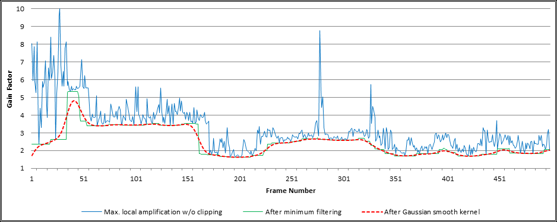
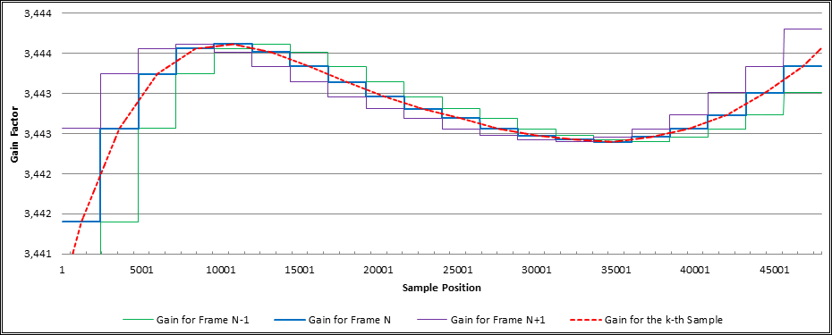
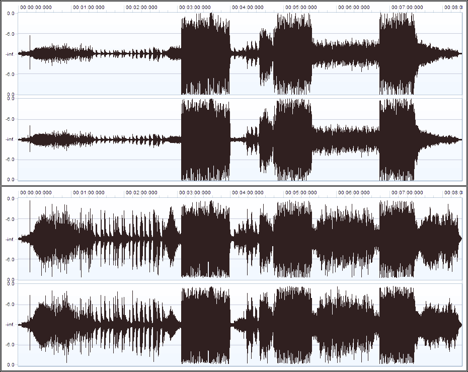
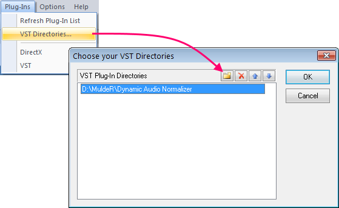
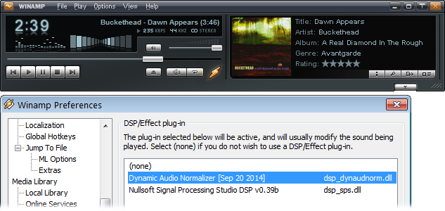
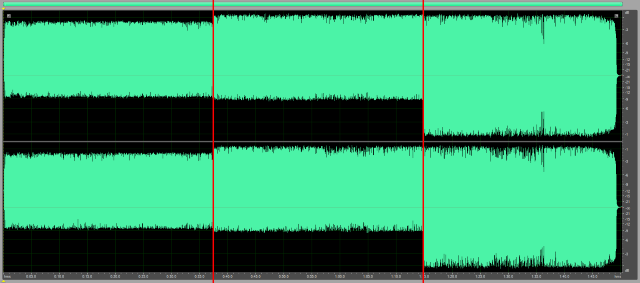
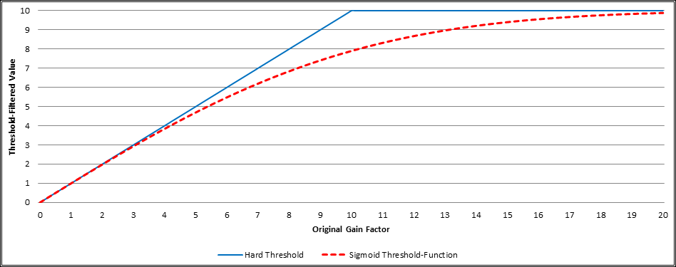
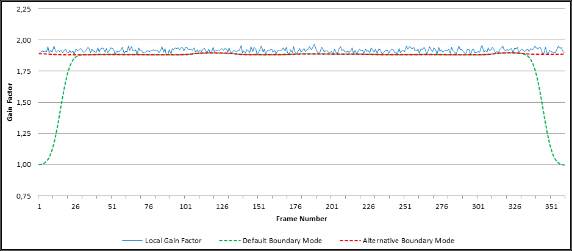

% Dynamic Audio Normalizer
% Created by LoRd_MuldeR &lt;<mulder2@gmx>&gt; &ndash; check <http://muldersoft.com/> for news and updates!


# Introduction #

**Dynamic Audio Normalizer** is a library for *advanced* [audio normalization](http://en.wikipedia.org/wiki/Audio_normalization) purposes. It applies a certain amount of gain to the input audio in order to bring its peak magnitude to a target level (e.g. 0 dBFS). However, in contrast to more "simple" normalization algorithms, the Dynamic Audio Normalizer *dynamically* re-adjusts the gain factor to the input audio. This allows for applying extra gain to the "quiet" sections of the audio while avoiding distortions or clipping the "loud" sections. In other words: The Dynamic Audio Normalizer will "even out" the volume of quiet and loud sections, in the sense that the volume of each section is brought to the same target level. Note, however, that the Dynamic Audio Normalizer achieves this goal *without* applying "dynamic range compressing". It will retain 100% of the dynamic range *within* each section of the audio file.

The *Dynamic Audio Normalizer* is available as a small standalone [command-line](http://en.wikipedia.org/wiki/Command-line_interface) utility and also as an effect in the [SoX](http://sox.sourceforge.net/) audio processor application. Furthermore, it can be integrated into your favourite DAW (digital audio workstation), as a [VST](http://de.wikipedia.org/wiki/Virtual_Studio_Technology) plug-in, or into your favourite media player, as a [Winamp](http://www.winamp.com/) plug-in. Last but not least, the "core" library can be integrated into custom applications easily, thanks to a straightforward [API](http://en.wikipedia.org/wiki/Application_programming_interface) (application programming interface). The "native" API is written in *C++*, but language [bindings](http://en.wikipedia.org/wiki/Language_binding) for *C99*, *Microsoft.NET*, *Java* and *Pascal* are provided.


# How It Works #

The "standard" audio normalization algorithm applies the same *constant* amount of gain to *all* samples in the file. Consequently, the gain factor must be chosen in a way that won't cause clipping/distortion – even for the input sample that has the highest magnitude. So if ``S_max`` denotes the highest magnitude sample in the input audio and ``Peak`` is the desired peak magnitude, then the gain factor will be chosen as ``G=Peak/abs(S_max)``. This works fine, as long as the volume of the input audio remains constant, more or less, all the time. If, however, the volume of the input audio varies significantly over time – as is the case with many "real world" recordings – the standard normalization algorithm will *not* give satisfying result. That's because the "loud" parts can *not* be amplified any further (without distortions) and thus the "quiet" parts will remain quiet too.

Dynamic Audio Normalizer solves this problem by processing the input audio in small chunks, referred to as *frames*. A frame typically has a length 500 milliseconds, but the frame size can be adjusted as needed. It then finds the highest magnitude sample *within* each frame. Finally it computes the maximum possible gain factor (without distortions) for each individual frame. So if ``S_max[n]`` denotes the highest magnitude sample within the ``n``-th frame, then the maximum possible gain factor for the ``n``-th frame will be ``G[n]=Peak/abs(S_max[n])``. Unfortunately, simply amplifying each frame with its own "local" maximum gain factor ``G[n]`` would *not* give satisfying results either. That's because the maximum gain factors can vary *strongly* and *unsteadily* between neighbouring frames! Therefore, applying the maximum possible gain to each frame *without* taking neighbouring frames into account would result in a strong *dynamic range compression* – which not only has a tendency to destroy the "vividness" of the audio but could also result in the "pumping" effect, i.e fast changes of the gain factor that become clearly noticeable to the listener.

The Dynamic Audio Normalizer tries to avoid these issues by applying an advanced *dynamic* normalization algorithm. Essentially, when processing a particular frame, it also takes into account a certain *neighbourhood* around the current frame, i.e. the frames *preceding* and *succeeding* the current frame will be considered as well. However, while information about *past* frames can simply be stored as long as they are needed, information about *future* frames are *not* normally available beforehand. Older versions of the Dynamic Audio Normalizer applied a *2-Pass* algorithm in order to solve this challenge, i.e. the entire audio file was simply processed twice. Newer versions of the Dynamic Audio Normalizer now use a huge "look ahead" buffer, which means that the audio frames will progress trough a [FIFO](http://en.wikipedia.org/wiki/FIFO) (first in, first out) buffer. The size of this buffer is chosen sufficiently large, so that a frame's *complete* neighbourhood, including the *subsequent* frames, will already be present in the buffer at the time when *that* frame is being processed. The "look ahead" buffer eliminates the need for 2-Pass processing and thus gives an improved performance.

With information about the frame's neighbourhood available, a [*Gaussian* smoothing kernel](http://en.wikipedia.org/wiki/Gaussian_blur) can be applied on those gain factors. Put simply, this smoothing filter "mixes" the gain factor of the ``n``-th frames with those of its *preceding* frames (``n-1``, ``n-2``, &hellip;) as well as with its *subsequent* frames (``n+1``, ``n+2``, …) – where "nearby" frames have a stronger influence (weight), while "distant" frames have a declining influence. This way, abrupt changes of the gain factor are avoided and, instead, we get *smooth transitions* of the gain factor over time. Furthermore, since the filter also takes into account *future* frames, Dynamic Audio Normalizer avoids applying strong gain to "quiet" frames located shortly before "loud" frames. In other words, Dynamic Audio Normalizer adjusts the gain factor *early* and thus nicely prevents clipping/distortion or abrupt gain reductions.

One more subject to consider is that applying the Gaussian smoothing kernel alone can *not* solve all problems. That's because the smoothing kernel will *not* only smoothen/delay *increasing* gain factors but also *declining* ones! If, for example, a very "loud" frame follows immediately after a sequence of "quiet" frames, the smoothing causes the gain factor to decrease early but slowly. As a result, the *filtered* gain factor of the "loud" frame could actually turn out to be *higher* than its (local) maximum gain factor – which results in distortion/clipping, if not taken care of! For this reason, the Dynamic Audio Normalizer *additionally* applies a "minimum" filter, i.e. a filter that replaces each gain factor with the *smallest* value within the neighbourhood. This is done *before* the Gaussian smoothing kernel in order to ensure that all gain transitions will remain smooth.

The following example shows the results form a "real world" audio recording that has been processed by the Dynamic Audio Normalizer. The chart shows the maximum local gain factors for each individual frame (blue) as well as the minimum filtered gain factors (green) and the final smoothend gain factors (orange). Note how smooth the progression of the final gain factors is, while approaching the maximum local gain factors as closely as possible. Also note how the smoothend gain factors *never* exceed the maximum local gain factor in order to avoid distortions.



So far it has been discussed how the optimal gain factor for each frame is determined. However, since each frame contains a large number of samples – at a typical sampling rate of 44,100 Hz and a standard frame size of 500 milliseconds we have 22,050 samples per frame – it is also required to infer the gain factor for each individual sample in the frame. The most simple approach, of course, is applying the *same* gain factor to *all* samples in the certain frame. But this would lead to abrupt changes of the gain factor at each frame boundary, while the gain factor remains constant within the frames. A better approach, as implemented in the Dynamic Audio Normalizer, is interpolating the per-sample gain factors. In particular, the Dynamic Audio Normalizer applies a *linear interpolation* in order to compute the gain factors for the samples inside the ``n``-th frame from the gain factors ``G'[n-1]``, ``G'[n]`` and ``G'[n+1]``, where ``G'[k]`` denotes the *final* gain factor for the ``k``-th frame. The following graph shows how the per-sample gain factors (orange) are interpolated from the gain factors of the preceding (green), current (blue) and subsequent (purple) frame.



Finally, the following waveform view illustrates how the volume of a "real world" audio recording has been harmonized by the Dynamic Audio Normalizer. The upper graph shows the unprocessed original recording while the lower graph shows the output as created by the Dynamic Audio Normalizer. As can be seen, the significant volume variation between the "loud" and the "quiet" parts that existed in the original recording has been rectified to a great extent, while retaining the dynamics of the input and avoiding clipping or distortion.




# Download & Installation #

Dynamic Audio Normalizer can be downloaded from one of the following *official* mirror sites:
* https://github.com/lordmulder/DynamicAudioNormalizer/releases/latest
* https://bitbucket.org/lord_mulder/dynamic-audio-normalizer/downloads
* http://sourceforge.net/projects/muldersoft/files/Dynamic%20Audio%20Normalizer/
* https://www.assembla.com/spaces/dynamicaudionormalizer/documents

**Note:** Windows binaries are provided in the *ZIP* format. Simply use [7-Zip](http://www.7-zip.org/) or a similar tool to unzip *all* files to new/empty directory. That's it!


## System Requirements ##

Dynamic Audio Normalizer "core" library and CLI front-end are written in plain C++11 and therefore do **not** have any system requirements, except for a conforming C++ compiler. Currently, the Microsoft C++ compiler and the GNU Compiler Collection are actively supported.

*Pre-compiled* binaries are provided for the *Windows* and  the *Linux* platform. The 32-Bit Windows binaries should work on Windows XP (with Service Pack 2) or any late version. The 64-Bit Windows binaries require the "x64" edition of Windows Vista or any later 64-Bit Windows. Linux binaries are provided for some popular distributions (latest version at the time of release). They may work on other distributions too, or not. Thus, Linux users are generally recommended to compile Dynamic Audio Normalizer themselves, from the source codes.

For the *Windows* platform, separate "Static" and "DLL" download packages are provided. The "Static" binaries have all the required program libraries *built-in* (including C++ Runtime) and thus do *not* depend on any separate DLL files. At the same time, the "DLL" package uses separate DLL files for the "core" functions as well as for the C++ Runtime. If you don't understand what this means, then just go with the "Static" version. If you want to call Dynamic Audio Normalizer from your own code, you need to use the "DLL" version.

All *pre-compiled* binaries have been compiled with the [*SSE2*](https://en.wikipedia.org/wiki/SSE2) instruction set enabled, so a processor with SSE2 support (i.e. Pentium 4 or later) is required. For *legacy* processors you will need to compile Dynamic Audio Normalizer from the sources &ndash; with appropriate CPU flags.


## Package Contents ##

The following files are included in the Dynamic Audio Normalizer release package (Windows version):

	DynamicAudioNormalizerCLI.exe - Dynamic Audio Normalizer command-line application
	DynamicAudioNormalizerGUI.exe - Dynamic Audio Normalizer log viewer application
	DynamicAudioNormalizerSoX.exe - SoX binary with included Dynamic Audio Normalizer effect
	DynamicAudioNormalizerAPI.dll - Dynamic Audio Normalizer core library
	DynamicAudioNormalizerVST.dll - Dynamic Audio Normalizer VST wrapper library
	DynamicAudioNormalizerAPI.lib - Import library for the Dynamic Audio Normalizer library
	DynamicAudioNormalizerNET.dll - .NET wrapper for the Dynamic Audio Normalizer library
	DynamicAudioNormalizerJNI.jar - Java wrapper for the Dynamic Audio Normalizer library
	DynamicAudioNormalizer.pas    - Pascal wrapper for the Dynamic Audio Normalizer library
	DynamicAudioNormalizer.h      - Header file for the Dynamic Audio Normalizer library
	msvcp120.dll                  - Visual C++ 2013 runtime library
	msvcr120.dll                  - Visual C++ 2013 runtime library
	libsndfile-1.dll              - libsndfile library, used for reading/writing audio files
	pthreadVC2.dll                - POSIX threading library, used for thread management
	QtCore4.dll                   - Qt library, used to create the graphical user interfaces
	QtGui4.dll                    - Qt library, used to create the graphical user interfaces
	README.html                   - The README file

**Note:** Standard binaries are *32-Bit* (x86), though *64-Bit* (AMD64/Intel64) versions can be found in the "x64" sub-directory.


# Command-Line Usage #

Dynamic Audio Normalizer program can be invoked via [command-line interface](http://en.wikipedia.org/wiki/Command-line_interface) (CLI), either *manually* from the [command prompt](http://en.wikipedia.org/wiki/Command_Prompt) or *automatically* by a [batch](http://en.wikipedia.org/wiki/Batch_file) file.


## Basic Command-Line Syntax ##

The basic Dynamic Audio Normalizer command-line syntax is as follows:  
``DynamicAudioNormalizerCLI.exe -i <;input_file> -o <output_file> [options]``

Note that the *input* file and the *output* file always have to be specified, while all other parameters are optional. But take care, an existing output file will be *overwritten*!

Also note that the Dynamic Audio Normalizer program uses [libsndfile](http://www.mega-nerd.com/libsndfile/) for input/output, so a wide range of file formats (WAV, W64, FLAC, Ogg/Vorbis, AIFF, AU/SND, etc) as well as various sample types (ranging from 8-Bit Integer to 64-Bit floating point) are supported.

Passing "raw" PCM data via [pipe](http://en.wikipedia.org/wiki/Pipeline_%28Unix%29) is supported too. Just specify the file name ``"-"`` in order to read from or write to the [stdin](http://en.wikipedia.org/wiki/Standard_streams) or [stdout](http://en.wikipedia.org/wiki/Standard_streams) stream, respectively. When reading from the *stdin*, you have to explicitly specify the *input* sample format, channel count and sampling rate.

For a list of *all* available options, please run ``DynamicAudioNormalizerCLI.exe --help`` from the command prompt. Also see to the [**configuration**](#configuration) chapter for more details!


## Command-Line Usage Examples ##

* Read input from Wave file and write output to a Wave file again:  
  ``DynamicAudioNormalizerCLI.exe -i "in_original.wav" -o "out_normalized.wav"``

* Read input from *stdin* (input is provided by [FFmpeg](http://ffmpeg.org/about.html) via pipe) and write output to Wave file:  
  ``ffmpeg.exe -i "movie.mkv" -loglevel quiet -vn -f s16le -c:a pcm_s16le - | DynamicAudioNormalizerCLI.exe -i - --input-bits 16 --input-chan 2 --input-rate 48000 -o "output.wav"``

* Read input from Wave file and write output to *stdout* (output is passed to [FFmpeg](http://ffmpeg.org/about.html) via pipe):  
  ``DynamicAudioNormalizerCLI.exe -i "input.wav" -o - | ffmpeg.exe -loglevel quiet -f s16le -ar 44100 -ac 2 -i - -c:a libmp3lame -qscale:a 2 "output.mp3"``


## SoX Integration Usage ##

As an alternative to the Dynamic Audio Normalizer command-line front-end, the Dynamic Audio Normalizer library may also be used as an effect in [**SoX** (Sound eXchange)](http://sox.sourceforge.net/), a versatile audio editor and converter.

Note, however, that *standard* SoX distributions do **not** currently support the Dynamic Audio Normalizer. Instead, a special *patched* build of SoX that has the Dynamic Audio Normalizer effect enabled is required!

When working with SoX, the Dynamic Audio Normalizer can be invoked by adding the "dynaudnorm" effect to your effect chain, which can be done as follows:  
``DynamicAudioNormalizerSoX.exe -S "in_original.wav" -o "out_normalized.wav" dynaudnorm [options]``

For details about the SoX command-line syntax, please refer to the [SoX documentation](http://sox.sourceforge.net/sox.html), or type ``DynamicAudioNormalizerSoX.exe --help-effect dynaudnorm`` for a list of available options.


## FFmpeg Integration Usage ##

Furthermore, the Dynamic Audio Normalizer now is also available as an audio filter in [**FFmpeg**](https://www.ffmpeg.org/), a complete, cross-platform solution to record, convert and stream audio and video. Thanks to *Paul B Mahol* for porting Dynamic Audio Normalizer code to FFmpeg.

Since the Dynamic Audio Normalizer has been committed to the official FFmpeg codebase, you can use *any* FFmpeg binary &ndash; the Dynamic Audio Normalizer distribution package does **not** contain FFmpeg binaries. Just be sure to grab an *up-to-date* FFmpeg that has the "dynaudnorm" filter integrated. Windows users can download ready-made FFmpeg binaries [here](http://ffmpeg.zeranoe.com/builds/). Linux users install FFmpeg from the package manager of their distribution or [build](https://trac.ffmpeg.org/wiki/CompilationGuide/Ubuntu) it themselves. If the FFmpeg included with your distribution is too old, find recent Linux binaries [here](http://johnvansickle.com/ffmpeg/).

When working with FFmpeg, the Dynamic Audio Normalizer can be invoked by adding the "dynaudnorm" audio filter, using the "-af" switch:
``ffmpeg.exe -i "in_original.wav" -af dynaudnorm "out_normalized.wav"``

For details about the FFmpeg command-line syntax, please refer to the [FFmpeg documentation](https://ffmpeg.org/ffmpeg-filters.html#dynaudnorm), see the [FFmpeg filtering guide](https://trac.ffmpeg.org/wiki/FilteringGuide), or type ``ffmpeg.exe -h full | more`` for a list of available options.


# VST Plug-In Usage #

<small>**VST PlugIn Interface Technology by Steinberg Media Technologies GmbH. VST is a trademark of Steinberg Media Technologies GmbH.**</small>

  

The Dynamic Audio Normalizer is also available in the form of a [**VST** (Virtual Studio Technology) plug-in](http://en.wikipedia.org/wiki/Virtual_Studio_Technology). The VST plug-in interface technology, developed by Steinberg Media Technologies, provides a way of integrating arbitrary audio effects (and instruments) into arbitrary applications – provided that the audio effect is available in the form of a VST plug-in and provided that the application supports "hosting" VST plug-ins. An application capable of loading and using VST plug-ins is referred to as a *VST host*. This means that the Dynamic Audio Normalizer can be used as an effect in *any* VST host. Note that VST is widely supported in [DAWs (Digital Audio Workstations)](http://en.wikipedia.org/wiki/Digital_audio_workstation) nowadays, including most of the popular Wave Editors. Therefore, the provided Dynamic Audio Normalizer VST plug-in can be integrated into all of these applications easily. Note that most VST hosts provide a graphical user interface to configure the VST plug-in. The screen capture below shows the Dynamic Audio Normalizer as it appears in the *Acoustica* software by Acon AS. The options exposed by the VST plug-in are identical to those exposed by the [CLI](#command-line-usage) version.


## Install Instructions ##

The exact steps that are required to load, activate and configure a VST plug-in differ from application to application. However, it will generally be required to make the application "recognize" the new VST plug-in, i.e. ``DynamicAudioNormalizerVST.dll`` first. Most applications will either pick up the VST plug-in from the *global* VST directory – usually located at ``C:\Program Files (x86)\Steinberg\Vstplugins`` on Windows – or provide an option to choose the directory from where to load the VST plug-in. This means that, depending on the individual application, you will either need to copy the Dynamic Audio Normalizer VST plug-in into the *global* VST directory *or* tell the application where the Dynamic Audio Normalizer VST plug-in is located. Note that, with some applications, it may also be required to *explicitly* scan for new VST pluig-ins. See the manual for details! The screen capture bellow shows the situation in the *Acoustica 6.0* software by Acon AS. Here we simply open the "VST Directories" dialogue from the "Plug-Ins" menu, then *add* the Dynamic Audio Normalizer directory and finally click "OK".



Furthermore, note that – unless you are using the *static* build of the Dynamic Audio Normalizer – the VST plug-in DLL, i.e. ``DynamicAudioNormalizerVST.dll``, also requires the Dynamic Audio Normalizer *core* library, i.e. ``DynamicAudioNormalizerAPI.dll``. This means that the *core* library **must** be made available to the VST host *in addition* to the VST plug-in itself. Otherwise, loading the VST plug-in DLL is going to fail! Copying the *core* library to the same directory, where the VST plug-in DLL, is located generally is **not** sufficient. Instead, the *core* library must be located in one of those directories that are checked for additional DLL dependencies (see [**here**](http://msdn.microsoft.com/en-us/library/windows/desktop/ms682586%28v=vs.85%29.aspx#standard_search_order_for_desktop_applications) for details). Therefore, it is *recommended* to copy the ``DynamicAudioNormalizerAPI.dll`` file into the same directory where the VST host's "main" executable (EXE file) is located.

**Important:** Please note that Dynamic Audio Normalizer VST plug-in uses the VST interface version 2.x, which is the most widely supported VST version at this time. VST interface version 3.x is *not* currently used, supported or required. Also note that *32-Bit* (x86) VST host application can <u>only</u> work with *32-Bit* VST plug-ins and, similarly, *64-Bit* (AMD64/Intel64) VST host application can <u>only</u> work with *64-Bit* VST plug-ins. Depending on the "bitness" of your individual VST host application, always the suitable VST plug-in DLL file, 32- or 64-Bit, must be chosen!


## Known VST Limitations ##

The algorithm used by the Dynamic Audio Normalizer uses a "look ahead" buffer. This necessarily requires that – at the beginning of the process – we read a certain minimum number of *input* samples <u>before</u> the first *output* samples can be computed. With a more flexible effect interface, like the one used by [SoX](http://sox.sourceforge.net/), the plug-in could request as many input samples from the host application as required, before it starts returning output samples. The *VST* interface, however, is rather limited in this regard: VST *enforces* that the plug-in process the audio in small chunks. The size of these chunks is *dictated* by the host application. Furthermore, VST *enforces* that the plug-in returns the corresponding output samples for each chunk of audio data *immediately* – the VST host won't provide the next chunk of input samples until the VST plug-in has returned the output samples for the previous chunk. To the best of our knowledge, there is **no** way to request even more input samples from the VST host! Consequently, the **only** known way to realize a "look ahead" buffer with VST is actually <u>delaying</u> all audio samples and returning some "silent" samples at the beginning.

At least, VST provides the VST plug-in with a method to *report* its delay to the VST host application. Unfortunately, to the best of our knowledge, the VST specification lacks a detailed description on how a host application is required to deal with such a delay. This means that the actual behaviour totally depends on the individual host application! Anyway, it is clear that, if a VST plug-in reports a delay of N samples, an audio editor **shall** discard the *first* N samples returned by that plug-in. Also, the audio editor **shall** feed N samples of additional "dummy" data to the plug-in at the very end of the process – in order to flush the pending output samples. In practice, however, it turns out that, while *some* audio editors show the "correct" behaviour, others do **not**. Those audio editors seem to *ignore* the plug-in's delay, so the audio file will end up shifted and truncated!

The Dynamic Audio Normalizer VST plug-in *does* report its delay to the VST host application. Thus, if you encounter shifted and/or truncated audio after the processing, this means that there is a **bug** in the VST host application. And, sadly, the plug-in can do absolutely *nothing* about this. Below, there is a non-exhaustive list of audio editors with *proper* VST support. Those have been tested to work correctly. There also is a list of audio editors with *known problems*. Those should **not** be used for VST processing, until the respective developers have fixed the issue…


## Supported VST Hosts ##

Non-exhaustive list of VST hosts that have been tested to *work correctly* with the Dynamic Audio Normalizer VST plug-in:

* **[Acoustica](http://acondigital.com/products/acoustica-audio-editor/), by Acon AS**  
  <span style="color:SeaGreen">VST support working</span> &nbsp;|&nbsp; unrestricted Freeware edition available &nbsp;|&nbsp; <span style="color:GoldenRod">**recommended!**</span>
  
* **[Audacity](http://sourceforge.net/projects/audacity/files/audacity/) v2.0.6+, by Audacity Team**  
  <span style="color:SeaGreen">VST support working</span> &nbsp;|&nbsp; free/libre OpenSource software &nbsp;|&nbsp; <span style="color:GoldenRod">**recommended!**</span>
  *Please see [**here**](http://wiki.audacityteam.org/wiki/VST_Plug-ins) for install instructions. Also make sure that the new "Buffer Delay Compensation" option is enabled!*
  
* **[GoldWave](http://www.goldwave.com/), by GoldWave Inc.**  
  <span style="color:SeaGreen">VST support working</span> &nbsp;|&nbsp; free *trial* version available &nbsp;|&nbsp; full version: $59 (lifetime license)
  
* **[REAPER](http://www.reaper.fm/), by Cockos Inc.**  
  <span style="color:SeaGreen">VST support working</span> &nbsp;|&nbsp; free *trial* version available &nbsp;|&nbsp; full version: $225 (full license)
  
* **[WaveLab](http://www.steinberg.net/en/products/wavelab/start.html), by Steinberg Media Technologies GmbH**
  <span style="color:SeaGreen">VST support working</span> &nbsp;|&nbsp; free *trial* version available &nbsp;|&nbsp; full version: $100 (for "Elements" edition)
  
* **[Audition CC](https://creative.adobe.com/products/audition) (formerly "Cool Edit Pro"), by Adobe Systems Inc.**  
  <span style="color:SeaGreen">VST support working</span> &nbsp;|&nbsp; free *trial* version available &nbsp;|&nbsp; full version: $20 per month ("single app")
  
* **[Sound Forge Pro](http://www.sonycreativesoftware.com/soundforgesoftware), by Sony (formerly Sonic Foundry)**  
  <span style="color:SeaGreen">VST support working</span> &nbsp;|&nbsp; free *trial* version available &nbsp;|&nbsp; full version: $400 (full license)

*<u>Disclaimer:</u> There is absolutely **no** guarantee for the currentness and/or correctness of the above information!*


## Problematic VST Hosts ##

List of VST hosts that have *known problems* and do **not** work correctly with VST plug-ins, such as the Dynamic Audio Normalizer:

* **[Audacity](http://audacity.sourceforge.net/) v2.0.5 (and older)**  
  <span style="color:FireBrick">VST support broken</span> → audio will be shifted and truncated → *fixed in Audacity v2.0.6+*
  
* **[Waveosaur](http://www.wavosaur.com/) v1.1.0**  
  <span style="color:FireBrick">VST support broken</span> → audio will be shifted and truncated
  
* **[Ocenaudio](http://www.ocenaudio.com.br/) v2.0.9**  
  <span style="color:FireBrick">VST support broken</span> → audio will be shifted and truncated + some plug-in settings are displayed incorrectly
  
* **[WavePad](http://www.nch.com.au/wavepad/), by NCH Software**  
  <span style="color:FireBrick">VST support broken</span> → audio will be shifted and truncated + doesn't expose the plug-in's settings
  
* **[Nero WaveEditor](http://www.nero.com/enu/downloads/) v12.5, by Nero AG**  
  <span style="color:FireBrick">VST support broken</span> → application crashes when trying to load *any* VST plug-in for some unknown reason
  
* **[AudioDope](http://www.audiodope.org/) v0.26**  
  <span style="color:FireBrick">VST support broken</span> → audio will be shifted and truncated + plug-in settings are displayed incorrectly
  
* **[Dexster Audio Editor](http://www.dexster.net/) v4.3, by Softdiv Software**  
  <span style="color:FireBrick">VST support broken</span> → audio will be shifted and truncated + doesn't expose the plug-in's settings
  
* **[AudioDirector](http://www.cyberlink.com/products/audiodirector/features_en_US.html) v4, by CyberLink Corp**  
  <span style="color:FireBrick">VST support broken</span> → audio will be shifted and truncated by a very large amount

*<u>Disclaimer:</u> There is absolutely **no** guarantee for the currentness and/or correctness of the above information!*

*If you are the developer of one of these tools and you fixed the problem already, then please let us know…*


# Winamp Plug-In Usage #

The Dynamic Audio Normalizer is also available in the form of a **DSP/Effect** plug-in for [Winamp](http://www.winamp.com/), the popular media player created by Nullsoft. This way, the Dynamic Audio Normalizer can be applied to your audio files during playback, in *real-time*.




## Install Instructions ##

If you have **not** installed the *latest* version of Winamp 5.x yet, please update your Winamp installation first. You can download the *latest* version from [here](http://forums.winamp.com/showpost.php?p=2984799&postcount=2) or [here](http://www.videohelp.com/tools/Winamp). Older versions are generally *not* recommended! Once the *latest* version of Winamp 5.x is installed, simply copy the provided Winamp plug-in file ``DynamicAudioNormalizerWA5.dll`` into the directory for Winamp *DSP/Effect* plug-ins. By default, that is the sub-directory ``Plugins`` *inside* your Winamp installation directory. So, if Winamp was installed at ``C:\Program Files (x86)\Winamp``, the *default* plug-in directory would be ``C:\Program Files (x86)\Winamp\Plugins``. If you have installed Winamp to a *different* directory or if you have changed the plug-in directory to a *different* location (see the Winamp "Perferences" dialogue), then please adjust the path accordingly!

Note that copying the plug-in DLL into the ``Plugins`` directory may require administrative privileges. That's because ``C:\Program Files (x86)`` is a protected system directory. Also note that the plug-in DLL **must** be *renamed* to ``dsp_dynaudnorm.dll`` in order to make Winmap recognize the DLL. Any other file name of your choice will work just as well, as long as it starts with the ``dsp_`` prefix. Once the plug-in DLL file is located at the correct place, e.g. ``C:\Program Files (x86)\Winamp\Plugins\dsp_dynaudnorm.dll``, it should appear in the Winamp "Preferences" dialogue after the next restart. More specifically, you should find the "Dynamic Audio Normalizer" plug-in on the "Plug-ins" → "DSP/Effect" page. Simply select the desired plug-in from the list of available *DSP/Effect* plug-ins and it will be active from now on.

Furthermore, note that – unless you are using the *static* build of the Dynamic Audio Normalizer – the Winamp plug-in DLL also requires the Dynamic Audio Normalizer *core* library, i.e. ``DynamicAudioNormalizerAPI.dll``. This means that the *core* library **must** be made available to Winamp *in addition* to the DSP/Effect plug-in itself. Otherwise, loading the DSP/Effect plug-in DLL is going to fail! Though, copying the *core* library to the same directory, where the plug-in DLL is located, i.e. the ``Plugins`` directory, generally is **not** sufficient. Instead, the *core* library must be located in one of those directories that are checked for additional DLL dependencies (see [**here**](http://msdn.microsoft.com/en-us/library/windows/desktop/ms682586%28v=vs.85%29.aspx#standard_search_order_for_desktop_applications) for details). Therefore, it is *recommended* to copy the ``DynamicAudioNormalizerAPI.dll`` file into the same directory where the Winamp "main" executable (EXE file) is located.


## Knwon Limitations ##

The Dynamic Audio Normalizer plug-in for Winamp does *not* provide a configuration dialogue yet, so always the *default* settings are used. This will be addressed in a futrure version.


# Configuration #

This chapter describes the configuration options that can be used to tweak the behaviour of the Dynamic Audio Normalizer.

While the default parameter of the Dynamic Audio Normalizer have been chosen to give satisfying results with a wide range of audio sources, it can be advantageous to adapt the parameters to the individual audio file as well as to your personal preferences. 


## Gaussian Filter Window Size ##

Probably the most important parameter of the Dynamic Audio Normalizer is the "window size" of the Gaussian smoothing filter. It can be controlled with the **``--gauss-size``** option. The filter's window size is specified in *frames*, centered around the current frame. For the sake of simplicity, this must be an *odd* number. Consequently, the default value of **31** takes into account the current frame, as well as the *15* preceding frames and the *15* subsequent frames. Using a *larger* window results in a *stronger* smoothing effect and thus in *less* gain variation, i.e. slower gain adaptation. Conversely, using a *smaller* window results in a *weaker* smoothing effect and thus in *more* gain variation, i.e. faster gain adaptation. In other words, the more you *increase* this value, the more the Dynamic Audio Normalizer will behave like a "traditional" normalization filter. On the contrary, the more you *decrease* this value, the more the Dynamic Audio Normalizer will behave like a dynamic range compressor. The following graph illustrates the effect of different filter sizes – *11* (orange), *31* (green), and *61* (purple) frames – on the progression of the final filtered gain factor.


## Target Peak Magnitude ##

The target peak magnitude specifies the highest permissible magnitude level for the *normalized* audio file. It is controlled by the **``--peak``** option. Since the Dynamic Audio Normalizer represents audio samples as floating point values in the *-1.0* to *1.0* range – regardless of the input and output audio format – this value must be in the *0.0* to *1.0* range. Consequently, the value *1.0* is equal to [0 dBFS](http://en.wikipedia.org/wiki/DBFS), i.e. the maximum possible digital signal level (± 32767 in a 16-Bit file). The Dynamic Audio Normalizer will try to approach the target peak magnitude as closely as possible, but at the same time it also makes sure that the normalized signal will *never* exceed the peak magnitude. A frame's maximum local gain factor is imposed directly by the target peak magnitude. The default value is **0.95** and thus leaves a [headroom](http://en.wikipedia.org/wiki/Headroom_%28audio_signal_processing%29) of *5%*. It is **not** recommended to go *above* this value!


## Channel Coupling ##

By default, the Dynamic Audio Normalizer will amplify all channels by the same amount. This means the *same* gain factor will be applied to *all* channels, i.e. the maximum possible gain factor is determined by the "loudest" channel. In particular, the highest magnitude sample for the ``n``-th frame is defined as ``S_max[n]=Max(s_max[n][1],s_max[n][2],…,s_max[n][C])``, where ``s_max[n][k]`` denotes the highest magnitude sample in the ``k``-th channel and ``C`` is the channel count. The gain factor for *all* channels is then derived from ``S_max[n]``. This is referred to as *channel coupling* and for most audio files it gives the desired result. Therefore, channel coupling is *enabled* by default. However, in some recordings, it may happen that the volume of the different channels is *uneven*, e.g. one channel may be "quieter" than the other one(s). In this case, the **``--no-coupling``** option can be used to *disable* the channel coupling. This way, the gain factor will be determined *independently* for each channel ``k``, depending only on the individual channel's highest magnitude sample ``s_max[n][k]``. This allows for harmonizing the volume of the different channels. The following wave view illustrates the effect of channel coupling: It shows an input file with *uneven* channel volumes (left), the same file after normalization with channel coupling *enabled* (center) and again after normalization with channel coupling *disabled* (right).


## DC Bias Correction##

An audio signal (in the time domain) is a sequence of sample values. In the Dynamic Audio Normalizer these sample values are represented in the *-1.0* to *1.0* range, regardless of the original input format. Normally, the audio signal, or "waveform", should be centered around the *zero point*. That means if we calculate the *mean* value of all samples in a file, or in a single frame, then the result should be *0.0* or at least very close to that value. If, however, there is a significant deviation of the mean value from *0.0*, in either positive or negative direction, this is referred to as a [*DC bias*](http://en.wikipedia.org/wiki/DC_bias) or *DC offset*. Since a DC bias is clearly undesirable, the Dynamic Audio Normalizer provides optional *DC bias correction*, which can be enabled using the **``--correct-dc``** switch. With DC bias correction *enabled*, the Dynamic Audio Normalizer will determine the mean value, or "DC correction" offset, of each input frame and *subtract* that value from all of the frame's sample values – which ensures those samples are centered around *0.0* again. Also, in order to avoid "gaps" at the frame boundaries, the DC correction offset values will be interpolated smoothly between neighbouring frames. The following wave view illustrates the effect of DC bias correction: It shows an input file with positive DC bias (left), the same file after normalization with DC bias correction *disabled* (center) and again after normalization with DC bias correction *enabled* (right).




## Maximum Gain Factor ##

The Dynamic Audio Normalizer determines the maximum possible (local) gain factor for each input frame, i.e. the maximum gain factor that does *not* result in clipping or distortion. The maximum gain factor is determined by the frame's highest magnitude sample. However, the Dynamic Audio Normalizer *additionally* bounds the frame's maximum gain factor by a predetermined (global) *maximum gain factor*. This is done in order to avoid excessive gain factors in "silent" or almost silent frames. By default, the *maximum gain factor* is **10.0**, but it can be adjusted using the **``--max-gain``** switch. For most input files the default value should be sufficient and it usually is **not** recommended to increase this value. Though, for input files with an extremely low overall volume level, it may be necessary to allow even higher gain factors. Note, however, that the Dynamic Audio Normalizer does *not* simply apply a "hard" threshold (i.e. cut off values above the threshold). Instead, a "sigmoid" threshold function will be applied, as depicted in the following chart. This way, the gain factors will smoothly approach the threshold value, but *never* exceed that value.




## Target RMS Value ##

By default, the Dynamic Audio Normalizer performs "peak" normalization. This means that the maximum local gain factor for each frame is defined (only) by the frame's highest magnitude sample. This way, the samples can be amplified as much as possible *without* exceeding the maximum signal level, i.e. *without* clipping. Optionally, however, the Dynamic Audio Normalizer can also take into account the frame's [*root mean square*](http://en.wikipedia.org/wiki/Root_mean_square), abbreviated RMS. In electrical engineering, the RMS is commonly used to determine the *power* of a time-varying signal. It is therefore considered that the RMS is a better approximation of the "perceived loudness" than just looking at the signal's peak magnitude. Consequently, by adjusting all frames to a *constant* RMS value, a *uniform* "perceived loudness" can be established. With the Dynamic Audio Normalizer, RMS processing can be enabled using the **``--target-rms``** switch. This specifies the desired RMS value, in the *0.0* to *1.0* range. There is **no** default value, because RMS processing is *disabled* by default. If a target RMS value has been specified, a frame's local gain factor is defined as the factor that would result in exactly *that* RMS value. Note, however, that the maximum local gain factor is still restricted by the frame's highest magnitude sample, in order to prevent clipping. The following chart shows the same file normalized *without* (green) and *with* (orange) RMS processing enabled.


## Frame Length ##

The Dynamic Audio Normalizer processes the input audio in small chunks, referred to as *frames*. This is required, because a *peak magnitude* has no meaning for just a single sample value. Instead, we need to determine the peak magnitude for a contiguous sequence of sample values. While a "standard" normalizer would simply use the peak magnitude of the *complete* file, the Dynamic Audio Normalizer determines the peak magnitude *individually* for each frame. The length of a frame is specified in milliseconds. By default, the Dynamic Audio Normalizer uses a frame length of **500** milliseconds, which has been found to give good results with most files, but it can be adjusted using the **``--frame-len``** switch. Note that the exact frame length, in number of samples, will be determined automatically, based on the sampling rate of the individual input audio file.


## Boundary Mode ##

As explained before, the Dynamic Audio Normalizer takes into account a certain neighbourhood around each frame. This includes the *preceding* frames as well as the *subsequent* frames. However, for the "boundary" frames, located at the very beginning and at the very end of the audio file, **not** all neighbouring frames are available. In particular, for the *first* few frames in the audio file, the preceding frames are *not* known. And, similarly, for the *last* few frames in the audio file, the subsequent frames are *not* known. Thus, the question arises which gain factors should be assumed for the *missing* frames in the "boundary" region. The Dynamic Audio Normalizer implements two modes to deal with this situation. The *default* boundary mode assumes a gain factor of exactly *1.0* for the missing frames, resulting in a smooth "fade in" and "fade out" at the beginning and at the end of the file, respectively. The *alternative* boundary mode can be enabled by using the **``--alt-boundary``** switch. The latter mode assumes that the missing frames at the *beginning* of the file have the same gain factor as the very *first* available frame. It furthermore assumes that the missing frames at the *end* of the file have same gain factor as the very *last* frame. The following chart illustrates the difference between the *default* (green) and the *alternative* (red) boundary mode. Note hat, for simplicity's sake, a file containing *constant* volume white noise was used as input here.




## Input Compression ##

By default, the Dynamic Audio Normalizer does **not** apply "traditional" compression. This means that signal peaks will **not** be pruned and thus the *full* dynamic range will be retained within each local neighbourhood. However, in some cases it may be desirable to *combine* the Dynamic Audio Normalizer's normalization algorithm with a more "traditional" compression. For this purpose, the Dynamic Audio Normalizer provides an *optional* compression (thresholding) function. It is disabled by default and can be enabled by using the **``--compress``** switch. If (and only if) the compression feature is enabled, all input frames will be processed by a [*soft knee*](https://mdn.mozillademos.org/files/5113/WebAudioKnee.png) thresholding function *prior to* the actual normalization process. Put simply, the thresholding function is going to prune all samples whose magnitude exceeds a certain threshold value. However, the Dynamic Audio Normalizer does *not* simply apply a fixed threshold value. Instead, the threshold value will be adjusted for each individual frame. More specifically, the threshold for a specific input frame is defined as ``T = μ + (c · σ)``, where **μ** is the *mean* of all sample magnitudes in the current frame, **σ** is the *standard deviation* of those sample magnitudes and **c** is the parameter controlled by the user. Note that, assuming the samples magnitudes are following (roughly) a [normal distribution](http://content.answcdn.com/main/content/img/barrons/accounting/New/images/normaldistribution2.jpg), about 68% of the sample values will be within the **μ ± σ** range, about 95% of the sample values will be within the **μ ± 2σ** range and more than 99% of the sample values will be within the **μ ± 3σ** range. Consequently, a parameter of **c = 2** will prune about 5% of the frame's highest magnitude samples, a parameter of **c = 3** will prune about 1% of the frame's highest magnitude samples, and so on. In general, *smaller* parameters result in *stronger* compression, and vice versa. Values below *3.0* are **not** recommended, because audible distortion may appear! The following waveform view illustrates the effect of the input compression feature: It shows the same input file *before* (upper view) and *after* (lower view) the thresholding function has been applied. Please note that, for the sake of clarity, the actual normalization process has been *disabled* in the following chart. Under normal circumstances, the normalization process is applied immediately after the thresholding function.


## Write Log File ##

Optionally, the Dynamic Audio Normalizer can create a log file. The log file name is specified using the **``--log-file``** option.  If that option is *not* used, then *no* log file will be written. The log file uses a simple text format. The file starts with a header, followed by a list of gain factors. In that list, there is one line per frame. In each line, the *first* column contains the maximum local gain factor, the *second* column contains the minimum filtered gain factor, and the *third* column contains the final smoothed gain factor. This sequence is repeated once per channel.

	DynamicAudioNormalizer Logfile v2.00-5
	CHANNEL_COUNT:2
	
	10.00000  8.59652  5.07585      10.00000  8.59652  5.07585
	 8.59652  8.59652  5.64167       8.59652  8.59652  5.64167
	 9.51783  8.59652  6.17045       9.51783  8.59652  6.17045
	...

The log file can be displayed as a graphical chart using, for example, the *Log Viewer* application (DynamicAudioNormalizerGUI) that is included with the Dynamic Audio Normalizer:


# API Documentation #

This chapter describes the **MDynamicAudioNormalizer** application programming interface (API), as defined in the ``DynamicAudioNormalizer.h`` header file. It allows software developer to call the Dynamic Audio Normalizer library from their own application code.


## Thread Safety: ##

Note that all methods of the ``MDynamicAudioNormalizer`` class are [*reentrant*](http://en.wikipedia.org/wiki/Reentrancy_%28computing%29), but **not** thread-safe! This means that it *is* safe to use the MDynamicAudioNormalizer class in *multi-threaded* applications, but *only* as long as each thread uses its own separate MDynamicAudioNormalizer instance. In other words, it is *strictly forbidden* to call the *same* MDynamicAudioNormalizer instance *concurrently* from *different* threads. But it *is* admissible to call *different* MDynamicAudioNormalizer instances *concurrently* from *different* threads, provided that each thread will access *only* its own instance. If the *same* MDynamicAudioNormalizer instance needs to be accessed by *different* threads, then the calling *application* is responsible for *serializing* all calls to that MDynamicAudioNormalizer instance, e.g. by means of a Mutex. Otherwise, **undefined behaviour** follows!


## Language Bindings: ##

Also note that the "native" MDynamicAudioNormalizer application programming interface (API) is provided in the form of a [*C++*](http://en.wikipedia.org/wiki/C%2B%2B) class, which means that *C++* applications can (and should) use the MDynamicAudioNormalizer class directly. In addition to that, [bindings](http://en.wikipedia.org/wiki/Language_binding) for various other programming languages are provided. The [*C99*](http://en.wikipedia.org/wiki/C99) API is provided in the same header file as the *C++* API. There is one *C*-based "wrapper" function for each method of the native *C++* class. These wrapper functions provide the exactly same functionality as the corresponding *C++* methods, except that an additional [*handle*](http://en.wikipedia.org/wiki/Handle_%28computing%29) needs to be passed around, in order to identify the MDynamicAudioNormalizer instance. The ``createInstance()`` and ``destroyInstance()`` functions exist in the *C*-based API only. They replace the *C++* constructor and destructor, respectively.

Furthermore, language bindings for the [*Microsoft.NET*]() platform (*C#*, *VisualBasic.NET*, etc.) as well as for the *[Java](http://en.wikipedia.org/wiki/Java_%28programming_language%29) Runtime Environment* and for [*Object Pascal*](http://en.wikipedia.org/wiki/Object_Pascal) (*Delphi 7.0* or later) are provided. For each of these languages, a suitable "wrapper" class is provided, which exposes the exactly same functions as the native C++ class. Any method call to one of those wrapper classes will be forwarded, *internally*, to the corresponding native method of to the underlying C++ class. Note, however, that any calls to the native Dynamic Audio Normalizer library are handled *transparently* by the individual wrapper class, which means that the application developer will **not** have to worry about interoperability issues. In particular, the wrapper class will take care, *automatically*, of data type mappings as well as of managing the native MDynamicAudioNormalizer instances.

Summary on language bindings:

* *C++* Application → Use the native ``MDynamicAudioNormalizer`` C++ class *directly*, provided by the ``DynamicAudioNormalizerAPI.dll`` library, corresponding header file is ``DynamicAudioNormalizerAPI.h``
* *C99*-based Application → Use the C99-based wrapper functions, also provided by the ``DynamicAudioNormalizerAPI.dll`` library, corresponding header file is ``DynamicAudioNormalizerAPI.h``
* *Microsoft.NET*-based Application → Use the ``DynamicAudioNormalizerNET`` [C++/CLI](http://en.wikipedia.org/wiki/C%2B%2B/CLI) wrapper class, provided by the ``DynamicAudioNormalizerNET.dll`` assembly, requires ``DynamicAudioNormalizerAPI.dll`` at runtime
* *Java*-based Application → Use the ``JDynamicAudioNormalizer`` [JNI](http://en.wikipedia.org/wiki/Java_Native_Interface) wrapper class, provided by the ``DynamicAudioNormalizerJNI.jar`` package, requires ``DynamicAudioNormalizerAPI.dll`` at runtime
* *Pascal*/*Delphi*-based Application → Use the ``TDynamicAudioNormalizer`` Object Pascal wrapper class, provided by the ``DynamicAudioNormalizer.pas`` file, requires ``DynamicAudioNormalizerAPI.dll`` at runtime


## Quick Start Guide: ##

The following listing summarizes the steps that an application needs to follow when using the API:

1. Create a new *MDynamicAudioNormalizer* instance.
2. Call the ``initialize()`` method, *once*, in order to initialize the MDynamicAudioNormalizer instance.
3. Call the ``processInplace()`` method, *in a loop*, until all input samples have been processed.
4. Call the ``flushBuffer()`` method, *in a loop*, until all the pending output samples have been flushed.
5. Destroy the *MDynamicAudioNormalizer* instance.

*Note:* The Dynamic Audio Normalizer library processes audio samples, but it does **not** provide any audio I/O capabilities. Reading or writing the audio samples from or to an audio file is up to the application. A library like [libsndfile](http://www.mega-nerd.com/libsndfile/) may be helpful.


## Function Reference: ##

### MDynamicAudioNormalizer::MDynamicAudioNormalizer() ### {-}
```
MDynamicAudioNormalizer(
	const uint32_t channels,
	const uint32_t sampleRate,
	const uint32_t frameLenMsec,
	const uint32_t filterSize,
	const double peakValue,
	const double maxAmplification,
	const double targetRms,
	const bool channelsCoupled,
	const bool enableDCCorrection,
	const bool altBoundaryMode,
	FILE *const logFile
);
```

Constructor. Creates a new *MDynamicAudioNormalizer* instance and sets up the normalization parameters.

**Parameters:**
* *channels*: The number of channels in the input/output audio stream (e.g. **2** for Stereo).
* *sampleRate*: The sampling rate of the input/output audio stream, in Hertz (e.g. **44100** for "CD Quality").
* *frameLenMsec*: The [frame length](#frame-length), in milliseconds. A typical value is **500** milliseconds.
* *filterSize*: The ["window size"](#gaussian-filter-window-size) of the Gaussian filter, in frames. Must be an *odd* number. (default: **31**).
* *peakValue*: Specifies the [peak magnitude](#target-peak-magnitude) for normalized audio, in the **0.0** to **1.0** range (default: **0.95**).
* *maxAmplification*: Specifies the [maximum gain factor](#maximum-gain-factor). Must be greater than **1.0** (default: **10.0**).
* *targetRms*: Specifies the [target RMS](#target-rms-value) value. Must be in the **0.0** to **1.0** range, **0.0** means *disabled* (default: **0.0**).
* *channelsCoupled*: Set to **true** in order to enable [channel coupling](#channel-coupling), or to **false** otherwise (default: **true**).
* *enableDCCorrection*: Set to **true** in order to enable [DC correction](#dc-bias-correction), or to **false** otherwise (default: **false**).
* *altBoundaryMode*: Set to **true** in order to enable the alternative [boundary mode](#boundary-mode) (default: **false**).
* *logFile*: An open **FILE*** handle with *write* access to be used for [logging](#write-log-file), or **NULL** to disable logging.


### MDynamicAudioNormalizer::~MDynamicAudioNormalizer() ### {-}
```
virtual ~MDynamicAudioNormalizer(void);
```

Destructor. Destroys the *MDynamicAudioNormalizer* instance and releases all memory that it occupied.


### MDynamicAudioNormalizer::initialize() ### {-}
```
bool initialize(void);
```

Initializes the MDynamicAudioNormalizer instance. Validates the parameters and allocates/initializes the required memory buffers.

This function *must* be called once for each new MDynamicAudioNormalizer instance. It *must* be called before ``processInplace()`` or ``setPass()`` are called.

**Return value:**
* Returns ``true`` if everything was successfull or ``false`` if something went wrong.


### MDynamicAudioNormalizer::processInplace() ### {-}
```
bool processInplace(
	double **samplesInOut,
	int64_t inputSize,
	int64_t &outputSize
);
```

This is the main processing function. It usually is called in a loop by the application until all input audio samples have been processed.

The function works "in place": It *reads* the original input samples from the specified buffer and then *writes* the normalized output samples, if any, back into the *same* buffer. The content of ``samplesInOut`` will **not** be preserved!

It's possible that a specific call to this function returns *fewer* output samples than the number of input samples that have been read! The pending samples are buffered internally and will be returned in a subsequent function call. This also means that the *i*-th output sample does **not** necessarily correspond to the *i*-th input sample. However, the samples are always returned in a strict FIFO (first in, first out) order. At the end of the process, when all input samples have been read, to application should call ``flushBuffer()`` in order to *flush* all pending output samples.

**Parameters:**
* *samplesInOut*: The buffer that contains the original input samples and that will receive the normalized output samples. The *i*-th input sample for the *c*-th channel is assumed to be stored at ``samplesInOut[c][i]``, as a double-precision floating point number in the **-1.00** to **1.00** range. All indices are zero-based. The output samples, if any, will be stored at the corresponding locations, thus *overwriting* the input data. Consequently, the *i*-th output sample for the *c*-th channel will be stored at ``samplesInOut[c][i]`` and is guaranteed to be inside the **-1.00** to **1.00** range.
* *inputSize*: The number of *input* samples that are available in the ``samplesInOut`` buffer. This also specifies the *maximum* number of output samples to be stored in the buffer.
* *outputSize*: Receives the number of *output* samples that have been stored in the ``samplesInOut`` buffer. Please note that this value can be *smaller* than ``inputSize`` size. It can even be *zero*!

**Return value:**
* Returns ``true`` if everything was successful or ``false`` if something went wrong.


### MDynamicAudioNormalizer::flushBuffer() ### {-}
```
bool flushBuffer(
	double **samplesOut,
	const int64_t bufferSize,
	int64_t &outputSize
);
```

This function can be called at the end of the process, after all input samples have been processed, in order to flush the pending samples from the internal buffer. It writes the next pending output samples into the output buffer, in FIFO (first in, first out) order, iff there are any pending output samples left in the internal buffer. Once this function has been called, you must call ``reset()`` before calling ``processInplace()`` again! If this function returns fewer output samples than the specified output buffer size, then this indicates that the internal buffer is empty now.

**Parameters:**
* *samplesOut*: The buffer that will receive the normalized output samples. The *i*-th output sample for the *c*-th channel will be stored at ``samplesOut[c][i]`` and is guaranteed to be inside the **-1.00** to **1.00** range. All indices are zero-based.
* *bufferSize*: Specifies the *maximum* number of output samples to be stored in the buffer.
* *outputSize*: Receives the number of *output* samples that have been stored in the ``samplesOut`` buffer. Please note that this value can be *smaller* than ``bufferSize`` size. It can even be *zero*! A value smaller than ``bufferSize`` indicates that all samples have been flushed now.

**Return value:**
* Returns ``true`` if everything was successfull or ``false`` if something went wrong.


### MDynamicAudioNormalizer::reset() ### {-}
```
bool reset(void);
```

Resets the internal state of the *MDynamicAudioNormalizer* instance. It normally is **not** required to call this function at all! The only exception is when you want to process *multiple* independent audio files with the *same* normalizer instance. In the latter case, call ``reset()`` *after* all samples of the ``n``-th audio file have been processed and *before* processing the first sample of the ``(n+1)``-th audio file. Also do *not* forget to flush the pending samples of the ``n``-th file from the internal buffer *before* calling ``reset()``; those samples would be lost permanently otherwise!

**Return value:**
* Returns ``true`` if everything was successfull or ``false`` if something went wrong.


### MDynamicAudioNormalizer::getConfiguration() ### {-}
```
bool getConfiguration(
	uint32_t &channels,
	uint32_t &sampleRate,
	uint32_t &frameLen,
	uint32_t &filterSize
);
```

This is a convenience function to retrieve the current configuration of an existing *MDynamicAudioNormalizer* instance.

**Parameters:**
* *channels*: Receives the number of channels that was set in the constructor.
* *sampleRate*: Receives the sampling rate, in Hertz, that was set in the constructor.
* *frameLen*: Receives the current frame length, in samples (**not** milliseconds).
* *filterSize*: Receives the Gaussian filter size, in frames, that was set in the constructor.

**Return value:**
* Returns ``true`` if everything was successfull or ``false`` if something went wrong.


### MDynamicAudioNormalizer::getInternalDelay() ### {-}
```
bool getInternalDelay(
	int64_t &delayInSamples,
);
```

This function can be used to determine the internal delay of the *MDynamicAudioNormalizer* instance. The internal delay is the (maximum) number of samples, per channel, that will be buffered internally. The ``processInplace()`` function will **not** return any output samples, until (at least) *this* number of input samples have been processed. It also specifies the (maximum) number of samples that can be – and should be – flushed from the internal buffer, at the end of the process, using the ``flushBuffer()`` function.

**Parameters:**
* *delayInSamples*: Receives the size of the internal buffer, in samples (per channel).

**Return value:**
* Returns ``true`` if everything was successful or ``false`` if something went wrong.


### MDynamicAudioNormalizer::getVersionInfo() [static] ### {-}
```
static void getVersionInfo(
	uint32_t &major,
	uint32_t &minor,
	uint32_t &patch
);
```

This *static* function can be called to determine the Dynamic Audio Normalizer library version.

**Parameters:**
* *major*: Receives the major version number. Value will currently be **1**.
* *minor*: Receives the minor version number. Value will be in the **0** to **99** range.
* *patch*: Receives the patch level. Value will be in the **0** to **9** range.


### MDynamicAudioNormalizer::getBuildInfo() [static] ### {-}
```
static void getBuildInfo(
	const char **date,
	const char **time,
	const char **compiler,
	const char **arch,
	bool &debug
);
```

This *static* function can be called to determine more detailed information about the specific Dynamic Audio Normalizer build.

**Parameters:**
* *date*: Receives a pointer to a *read-only* string buffer containing the build date, standard ```__DATE__``` format.
* *time*: Receives a pointer to a *read-only* string buffer containing the build time, standard ```__TIME__``` format.
* *compiler*: Receives a pointer to a *read-only* string buffer containing the compiler identifier (e.g. "MSVC 2013.2").
* *arch*: Receives a pointer to a *read-only* string buffer containing the architecture identifier (e.g. "x86" for IA32/x86 or "x64" for AMD64/EM64T).
* *debug*: Will be set to ``true`` if this is a *debug* build or to ``false`` otherwise. Don't use the *debug* version production!


### MDynamicAudioNormalizer::setLogFunction() [static] ### {-}
```
static LogFunction *setLogFunction(
	LogFunction *const logFunction
);
```

This *static* function can be called to register a *callback* function that will be called by the Dynamic Audio Normalizer in order to provide additional log messages. Note that initially *no* callback function will be registered. This means that until a callback function is registered by the application, all log messages will be *discarded*. Thus it is recommend to register your callback function *before* creating the first *MDynamicAudioNormalizer* instance. Also note that <i>at most</i> one callback function can be registered. This means that registering another callback function will <i>replace</i> the previous one. However, since a pointer to the previous callback function will be returned, multiple callback function can be chained. Finally note that this function is **not** thread-safe! This means that the application must ensure that all calls to this functions are properly serialized. In particular, calling this function while there exists at least one instance of *MDynamicAudioNormalizer* can result in race conditions and has to be avoided! Usually, an application will call this function early in its "main" function in order to register its callback function and then does **not** call it again.

**Parameters:**
* *logFunction*: A pointer to the new callback function to be registered. This can be ``NULL`` to disable logging entirely.

**Return value:**
* Returns a pointer to the *previous* callback function. This can be ``NULL``, e.g. if **no** callback function had been registered before.

#### Callback Function #### {-}

The signature of the callback function must be *exactly* as follows, with standard ``cdecl`` calling convention:
```
void LogFunction(
	const int logLevel,
	const char *const message
);
```

**Parameters:**
* *logLevel*: Specifies the level of the current log message. This can be either ``LOG_LEVEL_NFO``, ``LOG_LEVEL_WRN`` or ``LOG_LEVEL_ERR``, which indicates an <i>information</i>, <i>warning</i> or <i>error</i> message, respectively. The application may use this value to filter the log messages according to their importance. Messages of level ``LOG_LEVEL_NFO`` are for debugging purposes only, messages of level ``LOG_LEVEL_WRN`` indicate that there might be a problem of some sort and messages of ``LOG_LEVEL_ERR`` indicate that a serious malfunction has occurred.
* *message*: The log message. This is a pointer to a buffer, which contains a NULL-terminated C string. The character encoding of the string is UTF-8. The application should regard this string buffer as *read-only*. Also, this string buffer remains valid *only* until the callback function returns. Therefore, do *not* save a pointer to this buffer! If you need to retain the log message *after* the callback function returns, it must be *copied*, e.g. via ``strcpy()`` or ``strdup()``, into a *separate* buffer which is owned by the application.


# Source Code #

The source code of the Dynamic Audio Normalizer is available from one of the official [**Git**](http://git-scm.com/) repository mirrors:
* ``https://github.com/lordmulder/DynamicAudioNormalizer.git`` &nbsp; ([Browse](https://github.com/lordmulder/DynamicAudioNormalizer))
* ``https://bitbucket.org/lord_mulder/dynamic-audio-normalizer.git`` &nbsp; ([Browse](https://bitbucket.org/lord_mulder/dynamic-audio-normalizer/overview))
* ``https://gitlab.com/dynamic-audio-normalizer/dynamic-audio-normalizer.git`` &nbsp; ([Browse](https://gitlab.com/dynamic-audio-normalizer/dynamic-audio-normalizer/tree/master))
* ``https://git.assembla.com/dynamicaudionormalizer.git`` &nbsp; ([Browse](https://www.assembla.com/code/dynamicaudionormalizer/git/nodes))
* ``https://muldersoft.codebasehq.com/dynamicaudionormalizer/dynamicaudionormalizer.git`` &nbsp; ([Browse](https://muldersoft.codebasehq.com/changelog/dynamicaudionormalizer/dynamicaudionormalizer))
* ``https://repo.or.cz/DynamicAudioNormalizer.git`` &nbsp; ([Browse](http://repo.or.cz/w/DynamicAudioNormalizer.git))


## Supported Build Environments ##

The following build environments are currently supported:

* Microsoft Windows with Visual C++, tested under [Windows 7](http://windows.microsoft.com/) and [*Visual Studio 2013*](http://www.visualstudio.com/downloads/download-visual-studio-vs)

    - You can build *Dynamic Audio Normalizer* manually, by using the provided *solution* file ``DynamicAudioNormalizer.sln``

    - Optionally, you may run the deployment script ``z_build.bat``, which will also create deployment packages. You may need to edit the paths in the build script first!

* Linux with GCC/G++ and GNU Make, tested under [*Ubuntu 14.10*](https://ubuntu-mate.org/download/)

    - The provided Makefile assumes that the essential build utilities (*make*, *g++*, *libc-dev*, etc), as contained in Debian's ``build-essential`` package, are installed

    - You may need to install additional packages (*libsndfile*, *Qt*, *Apache Ant*, *JDK*, *Pandoc*, etc), in order to create a "full" build of *Dynamic Audio Normalizer*

    - Use ``make MODE=no-gui`` or ``make MODE=mininmal`` in order to build *without GUI* or to create a *minimal* build (core library + CLI front-end only), respectively


## Build Prerequisites ##
* [*POSIX Threads (PThreads)*](http://en.wikipedia.org/wiki/POSIX_Threads) is *always* required (on Windows use [*pthreads-w32*](https://www.sourceware.org/pthreads-win32/), by Ross P. Johnson)
* [*libsndfile*](http://www.mega-nerd.com/libsndfile/), by Erik de Castro Lopo, is required for building the command-line program
* [*Qt Framework*](http://qt-project.org/), by Qt Project, is required for building the log viewer GUI program (recommended version: Qt 4.x)
* [*Ant*](http://ant.apache.org/), by Apache Software Foundation, is required for building the JNI bindings (recommended version: 1.9.x)
* [*Java Develpment Kit (JDK)*](http://www.oracle.com/technetwork/java/javase/downloads/index-jsp-138363.html), by Oracle, is required for building the JNI bindings (recommended version: JDK 8)
* [*VST SDK v2.4*](http://www.steinberg.de/en/company/developer.html), by Steinberg GmbH, is required for building the VST plug-in (it's still included in the VST 3.x SDK!)
* [*Winamp SDK*](http://forums.winamp.com/showthread.php?t=252090), by Nullsoft Inc, is required for building the Winamp plug-in (recommended version: 5.55)
* [*Pandoc*](http://johnmacfarlane.net/pandoc/), by  John MacFarlane, is required for generating the HTML documentation
* [*UPX*](http://upx.sourceforge.net/), by Markus Franz Xaver Johannes Oberhumer et al., is required for "packing" the libraries/executables


# Changelog #

## Version 2.08 (2015-01-20) ## {-}
* CLI front-end: Very short files (shorter than Gaussian window size) are now handled properly
* Core library: Fixed case when ``flushBuffer()`` is called *before* internal buffer is filled entirely
* Core library: Workaround for the [*FMA3 bug*](https://connect.microsoft.com/VisualStudio/feedback/details/987093/x64-log-function-uses-vpsrlq-avx-instruction-without-regard-to-operating-system-so-it-crashes-on-vista-x64) in the Microsoft Visual C++ 2013 runtime libraries
* Makefile: Various improvements

## Version 2.07 (2014-11-01) ## {-}
* Implemented [.NET](http://en.wikipedia.org/wiki/.NET_Framework) API → Dynamic Audio Normalizer can be used in, e .g., *C#*-based applications
* Implemented [JNI](http://en.wikipedia.org/wiki/Java_Native_Interface) API → Dynamic Audio Normalizer can be used in *Java*-based  applications
* Implemented [Pascal](http://en.wikipedia.org/wiki/Object_Pascal) API → Dynamic Audio Normalizer can be used in *Pascal*-based applications
* Core library: Added new ``getConfiguration()`` API to retrieve the *active* configuration params
* Core library: Fixed a bug that caused the gain factors to *not* progress as "smoothly" as intended

## Version 2.06 (2014-09-22) ## {-}
* Implemented [Winamp](http://www.winamp.com/) wrapper → Dynamic Audio Normalizer can now be used as Winamp plug-in
* VST wrapper: Fixed potential audio corruptions due to the occasional insertion of "silent" samples
* VST wrapper: Fixed a potential "double free" crash in the VST wrapper code
* Core library: Fixed ``reset()`` API to actually work as expected (some state was *not* cleared before)
* Core library: Make sure the number of delayed samples remains *constant* throughout the process

## Version 2.05 (2014-09-10) ## {-}
* Significant overhaul of the *compression* (thresholding) function
* Implemented [VST](http://en.wikipedia.org/wiki/Virtual_Studio_Technology) wrapper → Dynamic Audio Normalizer can now be integrated in any VST host
* Added *64-Bit* library and VST plug-in binaries to the Windows release packages
* No longer use ``__declspec(thread)``, because it can crash libraries on Windows XP ([details](http://www.nynaeve.net/?p=187))

## Version 2.04 (2014-08-25) ## {-}
* Added an optional input *compression* (thresholding) function
* Implemented [SoX](http://sox.sourceforge.net/) wrapper → Dynamic Audio Normalizer can now be used as a SoX effect
* Improved internal handling of "raw" PCM data

## Version 2.03 (2014-08-11) ## {-}
* Implemented an *optional* RMS-based normalization mode
* Added support for "raw" (headerless) audio data
* Added pipeline support, i.e. reading from *stdin* or writing to *stdout*
* Enabled FLAC/Vorbis support in the *static* Win32 binaries
* Various fixes and minor improvements

## Version 2.02 (2014-08-03) ## {-}
* Update license → core library is now released under LGPL v2.1
* Enabled FLAC *output* in the command-line program
* Show legend in the log viewer program
* Some minor documentation and build file updates
* There are **no** code changes in the core library in this release

## Version 2.01 (2014-08-01) ## {-}
* Added graphical log viewer application to the distribution package
* Improved the threshold function for the handling of the maximum gain factor limit
* Added a new mode for handling the "boundary" frames (disabled by default)
* Much improved the format of the log file

## Version 2.00 (2014-07-26) ## {-}
* Implemented a large lookahead buffer, which eliminates the need of 2-Pass processing
* Dynamic Audio Normalizer now works with a *single* processing pass → results in up to 2× speed-up!
* Removed the ``setPass()`` API, because it is *not* applicable any more
* Added new ``flushBuffer()`` API, which provides a cleaner method of flushing the pending frames
* Added new ``reset()`` API, which can be used to reset the internal state of the normalizer instance
* Added new ``setLogFunction`` API, which can be used to set up a custom logging callback function
* There should be **no** changes of the normalized audio output in this release whatsoever

## Version 1.03 (2014-07-09) ## {-}
* Added *static* library configuration to Visual Studio solution
* Various compatibility fixes for Linux/GCC
* Added Makefiles for Linux/GCC, tested under Ubuntu 14.04 LTS
* There are **no** functional changes in this release

## Version 1.02 (2014-07-06) ## {-}
* First public release of the Dynamic Audio Normalizer.


# Frequently Asked Questions (FAQ)

## Q: How does Dynamic Audio Normalizer differ from dynamic range compression? ##

A traditional [*audio compressor*](http://en.wikipedia.org/wiki/Dynamic_range_compression) will prune all samples whose magnitude is above a certain threshold. In particular, the portion of the sample's magnitude that is above the pre-defined threshold will be reduced by a certain *ratio*, typically *2:1* or *4:1*. In other words, the signal *peaks* will be *flattened*, while all samples below the threshold are passed through unmodified. This leaves a certain "headroom", i.e. after flattening the signal peaks the maximum magnitude remaining in the *compressed* file will be lower than in the original. For example, if we apply *2:1* reduction to all samples above a threshold of *80%*, then the maximum remaining magnitude will be at *90%*, leaving a headroom of *10%*. After the compression has been applied, the resulting sample values will (usually) be amplified again, by a certain *fixed* gain factor. This factor will be chosen as high as possible *without* exceeding the maximum allowable signal level, similar to a traditional *normalizer*. Clearly, the compression allows for a much stronger amplification of the signal than what would be possible otherwise. However, due to the *flattening* of the signal peaks, the *dynamic range*, i.e. the ratio between the largest and smallest sample value, will be *reduced* significantly – which has a strong tendency to destroy the "vividness" of the audio signal! The excessive use of dynamic range compression in many recent productions is also known as the ["loudness war"](https://www.youtube.com/watch?v=3Gmex_4hreQ).

The following waveform view shows an audio signal prior to dynamic range compression (left), after the compression step (center) and after the subsequent amplification step (right). It can be seen that the original audio had a *large* dynamic range, with each drumbeat causing a significant peak. It can also be seen how those peeks have been *eliminated* for the most part after the compression. This makes the drum sound much *less* catchy! Last but not least, it can be seen that the final amplified audio now appears much "louder" than the original, but the dynamics are mostly gone…


In contrast, the Dynamic Audio Normalizer also implements dynamic range compression *of some sort*, but it does **not** prune signal peaks above a *fixed* threshold. Actually it does **not** prune any signal peaks at all! Furthermore, it does **not** amplify the samples by a *fixed* gain factor. Instead, an "optimal" gain factor will be chosen for each *frame*. And, since a frame's gain factor is bounded by the highest magnitude sample within that frame, **100%** of the dynamic range will be preserved *within* each frame! The Dynamic Audio Normalizer only performs a "dynamic range compression" in the sense that the gain factors are *dynamically* adjusted over time, allowing "quieter" frames to get a stronger amplification than "louder" frames. This means that the volume differences between the "quiet" and the "loud" parts of an audio recording will be *harmonized* – but still the *full* dynamic range is being preserved within each of these parts. Finally, the Gaussian filter applied by the Dynamic Audio Normalizer ensures that any changes of the gain factor between neighbouring frames will be smooth and seamlessly, avoiding noticeable "jumps" of the audio volume.


## Q: But what if I do *not* want the "quiet" and "loud" parts to be harmonized? ##

In this case, the Dynamic Audio Normalizer simply may *not* be the right tool for what you are trying to achieve. Still, by using a larger [filter size](#gaussian-filter-window-size), the Dynamic Audio Normalizer may be configured to act much more similar to a "traditional" normalization filter.


## Q: Why does the program crash with "GURU MEDITATION" error every time? ##

This error message indicates that the program has encountered a serious problem. On possible reason is that your processor does **not** support the [SSE2](http://en.wikipedia.org/wiki/SSE2) instruction set. That's because the official Dynamic Audio Normalizer binaries have been compiled with SSE and SSE2 code enabled – like pretty much any compiler does *by default* nowadays. So without SSE2 support, the program cannot run, obviosuly. This can be fixed either by upgrading your system to a less antiquated processor, or by recompiling Dynamic Audio Normalizer from the sources with SSE2 code generation *disabled*. Note that SSE2 is supported by the Pentium 4 and Athon 64 processors as well as **all** later processors. Also *every* 64-Bit supports SSE2, because [x86-64](http://en.wikipedia.org/wiki/X86-64) has adopted SSE2 as "core" instructions. That means that *every processor from the last decade* almost certainly supports SSE2.

If your processor *does* support SSE2, but you still get the above error message, you probably have found a bug. In this case it is highly recommended to create a *debug build* and use a [debugger](http://en.wikipedia.org/wiki/Debugger) in order to track down the cause of the problem.


# License Terms #

## Dynamic Audio Normalizer Library ##

The Dynamic Audio Normalizer **library** (DynamicAudioNormalizerAPI) is released under the *GNU Lesser General Public License*, Version 2.1.

	Dynamic Audio Normalizer - Audio Processing Library
	Copyright (C) 2015 LoRd_MuldeR <mulder2@gmx.de>. Some rights reserved.
	
	This library is free software; you can redistribute it and/or
	modify it under the terms of the GNU Lesser General Public
	License as published by the Free Software Foundation; either
	version 2.1 of the License, or (at your option) any later version.
	
	This library is distributed in the hope that it will be useful,
	but WITHOUT ANY WARRANTY; without even the implied warranty of
	MERCHANTABILITY or FITNESS FOR A PARTICULAR PURPOSE.  See the GNU
	Lesser General Public License for more details.
	
	You should have received a copy of the GNU Lesser General Public
	License along with this library; if not, write to the Free Software
	Foundation, Inc., 51 Franklin Street, Fifth Floor, Boston, MA  02110-1301  USA

**http://www.gnu.org/licenses/lgpl-2.1.html**


## Dynamic Audio Normalizer CLI ##

The Dynamic Audio Normalizer **command-line program** (DynamicAudioNormalizerCLI) is released under the *GNU General Public License*, Version 2.

	Dynamic Audio Normalizer - Audio Processing Utility
	Copyright (C) 2015 LoRd_MuldeR <mulder2@gmx.de>. Some rights reserved.
	
	This program is free software; you can redistribute it and/or
	modify it under the terms of the GNU General Public License
	as published by the Free Software Foundation; either version 2
	of the License, or (at your option) any later version.
	
	This program is distributed in the hope that it will be useful,
	but WITHOUT ANY WARRANTY; without even the implied warranty of
	MERCHANTABILITY or FITNESS FOR A PARTICULAR PURPOSE.  See the
	GNU General Public License for more details.
	
	You should have received a copy of the GNU General Public License
	along with this program; if not, write to the Free Software
	Foundation, Inc., 51 Franklin Street, Fifth Floor, Boston, MA  02110-1301, USA.


**http://www.gnu.org/licenses/gpl-2.0.html**

## Dynamic Audio Normalizer GUI ##

The Dynamic Audio Normalizer **log viewer program** (DynamicAudioNormalizerGUI) is released under the *GNU General Public License*, Version 3.

	Dynamic Audio Normalizer - Audio Processing Utility
	Copyright (C) 2015 LoRd_MuldeR <mulder2@gmx.de>. Some rights reserved.
	
	This program is free software: you can redistribute it and/or modify
	it under the terms of the GNU General Public License as published by
	the Free Software Foundation, either version 3 of the License, or
	(at your option) any later version.
	
	This program is distributed in the hope that it will be useful,
	but WITHOUT ANY WARRANTY; without even the implied warranty of
	MERCHANTABILITY or FITNESS FOR A PARTICULAR PURPOSE.  See the
	GNU General Public License for more details.
	
	You should have received a copy of the GNU General Public License
	along with this program.  If not, see <http://www.gnu.org/licenses/>.
	
	**http://www.gnu.org/licenses/gpl-3.0.html**


## Dynamic Audio Normalizer Plug-In Wrapper ##

The Dynamic Audio Normalizer **plug-in** wrappers for *SoX*, *VST* and *Winamp* are released under the *MIT/X11 License*.

	Dynamic Audio Normalizer - Audio Processing Utility
	Copyright (C) 2015 LoRd_MuldeR <mulder2@gmx.de>. Some rights reserved.
	
	Permission is hereby granted, free of charge, to any person obtaining a copy
	of this software and associated documentation files (the "Software"), to deal
	in the Software without restriction, including without limitation the rights
	to use, copy, modify, merge, publish, distribute, sublicense, and/or sell
	copies of the Software, and to permit persons to whom the Software is
	furnished to do so, subject to the following conditions:
	
	The above copyright notice and this permission notice shall be included in
	all copies or substantial portions of the Software.
	
	THE SOFTWARE IS PROVIDED "AS IS", WITHOUT WARRANTY OF ANY KIND, EXPRESS OR
	IMPLIED, INCLUDING BUT NOT LIMITED TO THE WARRANTIES OF MERCHANTABILITY,
	FITNESS FOR A PARTICULAR PURPOSE AND NONINFRINGEMENT. IN NO EVENT SHALL THE
	AUTHORS OR COPYRIGHT HOLDERS BE LIABLE FOR ANY CLAIM, DAMAGES OR OTHER
	LIABILITY, WHETHER IN AN ACTION OF CONTRACT, TORT OR OTHERWISE, ARISING FROM,
	OUT OF OR IN CONNECTION WITH THE SOFTWARE OR THE USE OR OTHER DEALINGS IN
	THE SOFTWARE.

**http://opensource.org/licenses/MIT**


# Acknowledgement #

The Dynamic Audio Normalizer **command-line program** (DynamicAudioNormalizerCLI) incorporates the following *third-party* software:

* [**libsndfile**](http://www.mega-nerd.com/libsndfile/)  
  C library for reading and writing files containing sampled sound through one standard library interface  
  Copyright (C) 1999-2011 Erik de Castro Lopo
  
The Dynamic Audio Normalizer **log viewer program** (DynamicAudioNormalizerGUI) incorporates the following *third-party* software:

* [**Qt Framework**](http://qt-project.org/)  
  Cross-platform application and UI framework for developers using C++ or QML, a CSS & JavaScript like language  
  Copyright (C) 2014 Digia Plc and/or its subsidiary(-ies)
  
* [**QCustomPlot**](http://www.qcustomplot.com/)  
  Qt C++ widget for plotting and data visualization that focuses on making good looking, publication quality 2D plots  
  Copyright (C) 2011-2014 Emanuel Eichhammer

The Dynamic Audio Normalizer can operate as a **plug-in** (effect) using the following *third-party* applications or technologies:

  * [**Sound eXchange**](http://sox.sourceforge.net/)  
  Cross-platform command line utility that can convert various formats of computer audio files in to other formats  
  Copyright (C) 1998-2009 Chris Bagwell and SoX contributors

  * [**Virtual Studio Technology (VST 2.x)**](http://en.wikipedia.org/wiki/Virtual_Studio_Technology)  
  Software interface that integrates software audio synthesizer and effect Plug-ins with audio editors and recording systems.  
  Copyright (C) 2006 Steinberg Media Technologies. All Rights Reserved.  
  <small>**VST PlugIn Interface Technology by Steinberg Media Technologies GmbH. VST is a trademark of Steinberg Media Technologies GmbH.**</small>

  * [**Winamp**](http://www.winamp.com/)  
  Popular media player for Windows, Android, and OS X that supports extensibility with plug-ins and skins.
  Copyright (C) 1997-2013 Nullsoft, Inc. All Rights Reserved.  

The Dynamic Audio Normalizer **VST wrapper** (DynamicAudioNormalizerVST) incorporates the following *third-party* software:

* [**Spooky Hash V2**](http://burtleburtle.net/bob/hash/spooky.html)  
  Public domain noncryptographic hash function producing well-distributed 128-bit hash values
  Created by Bob Jenkins. Public domain.


&nbsp;  
&nbsp;  

e.o.f.
