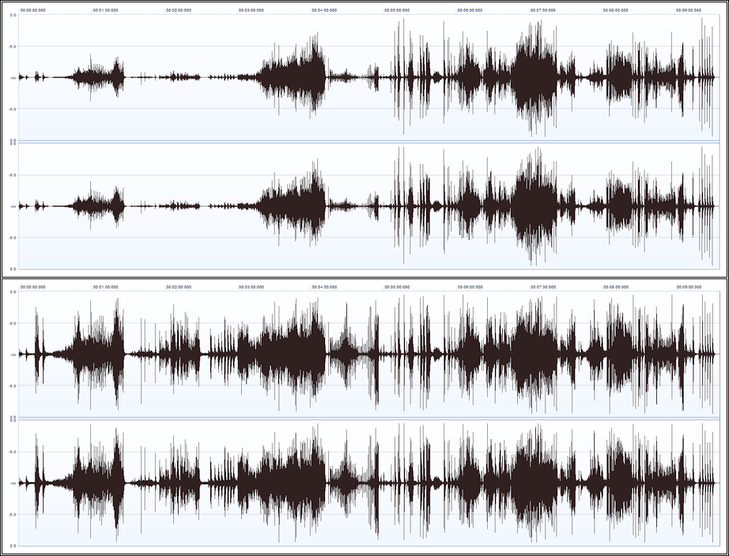
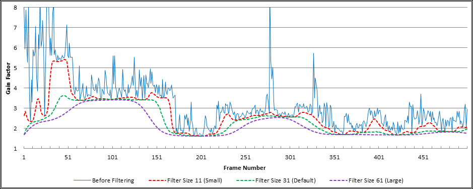
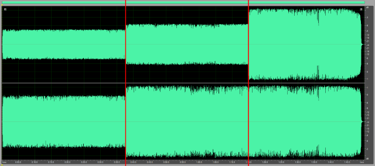

Dynamic Audio Normalizer
===============================================================================

<small>Created by LoRd_MuldeR <<mulder2@gmx>></tt> – Please check http://muldersoft.com/ for news and updates!</small>

**Dynamic Audio Normalizer** is a library and a command-line tool for [audio normalization](http://en.wikipedia.org/wiki/Audio_normalization). It applies a certain amount of gain to the input audio in order to bring its peak magnitude to a target level (e.g. 0 dBFS). However, in contrast to more "simple" normalization algorithms, the Dynamic Audio Normalizer *dynamically* adjusts the gain factor to the input audio. This allows for applying extra gain to the "quiet" parts of the audio while avoiding distortions or clipping the "loud" parts. In other words, the volume of the "quiet" and the "loud" parts will be harmonized.

### Contents: ###
1. [How It Works](#chap_how)
2. [Command-Line Usage](#chap_cli)
3. [Configuration](#chap_cfg)
4. [API Documentation](#chap_api)
5. [Source Code](#chap_src)
6. [Changelog](#chap_log)
7. [License Terms](#chap_lic)

How It Works<a name="chap_how"></a>
-------------------------------------------------------------------------------

The "standard" audio normalization algorithm applies the same *constant* amount of gain to *all* samples in the file. Consequently, the gain factor must be chosen in a way that won't cause clipping/distortion – even for the input sample that has the highest magnitude. So if <tt>S_max</tt> denotes the highest magnitude sample in the input audio and <tt>Peak</tt> is the desired peak magnitude, then the gain factor will be chosen as <tt>G=Peak/abs(S_max)</tt>. This works fine, as long as the volume of the input audio remains constant, more or less, all the time. If, however, the volume of the input audio varies significantly over time – as is the case with many "real world" recordings – the standard normalization algorithm will *not* give satisfying result. That's because the "loud" parts can *not* be amplified any further (without distortions) and thus the "quiet" parts will remain quiet too.

Dynamic Audio Normalizer solves this problem by processing the input audio in small chunks, referred to as *frames*. A frame typically has a length 500 milliseconds, but the frame size can be adjusted as needed. It then finds the highest magnitude sample *within* each frame. Finally it computes the maximum possible gain factor (without distortions) for each individual frame. So if <tt>S_max[n]</tt> denotes the highest magnitude sample within the <tt>n</tt>-th frame, then the maximum possible gain factor for the <tt>n</tt>-th frame will be <tt>G[n]=Peak/abs(S_max[n])</tt>. Unfortunately, simply amplifying each frame with its own "local" maximum gain factor <tt>G[n]</tt> would *not* give satisfying results either. That's because the maximum gain factors can vary *strongly* and *unsteadily* between neighbouring frames! Therefore, applying the maximum possible gain to each frame *without* taking neighbouring frames into account would result in a strong *dynamic range compression* – which not only has a tendency to destroy the "vividness" of the audio but could also result in the "pumping" effect, i.e fast changes of the gain factor that become clearly noticeable to the listener.

The Dynamic Audio Normalizer tries to avoid these issues by applying an advanced *2-Pass* normalization algorithm. Essentially, while the *first* pass computes (and stores) the maximum "local" gain factor <tt>G[n]</tt> for each individual frame, the actual normalization takes place in the *second* pass. Before the second pass starts, a [*Gaussian* smoothing kernel](http://en.wikipedia.org/wiki/Gaussian_blur) will be applied to the gain factors. Put simply, this filter "mixes" the gain factor of the <tt>n</tt>-th frames with those of all its preceding frames (<tt>n-1</tt>, <tt>n-2</tt>, &hellip;) as well as with all its subsequent frames (<tt>n+1</tt>, <tt>n+2</tt>, …) – where "near by" frames, in both directions, have a stronger influence, while "far away" frames, in both directions, have a declining influence. This way, abrupt changes of the gain factor are avoided and, instead, we get *smooth transitions* of the gain factor over time. Furthermore, since the filter also takes into account *future* frames, Dynamic Audio Normalizer avoids applying strong gain to "quiet" frames located shortly before "loud" frames. This can also be understood as a *lookahead* function which adjusts the gain factor *early* and thus nicely prevents clipping/distortion or abrupt gain reductions.

One more detail to consider is that applying the Gaussian smoothing kernel alone can *not* solve all problems. That's because the smoothing kernel will *not* only smoothen/delay *increasing* gain factors but also *declining* ones! If, for example, a very "loud" frame follows immediately after a sequence of "quiet" frames, the smoothing causes the gain factor to decrease early but slowly. As a result, the *filtered* gain factor of the "loud" frame could actually turn out to be *higher* than its (local) maximum gain factor – which results in distortion/clipping, if not taken care of! For this reason, the Dynamic Audio Normalizer *additionally* applies a "minimum" filter, i.e. a filter that replaces each gain factor with the *smallest* value within a certain neighbourhood. This is done *before* the Gaussian smoothing kernel in order to ensure that all gain transitions will remain smooth.

The following example shows the results form a "real world" audio recording that has been processed by the Dynamic Audio Normalizer. The chart shows the maximum local gain factors for each individual frame (blue) as well as the minimum filtered gain factors (green) and the final smoothend gain factors (orange). Note how smooth the progression of the final gain factors is, while approaching the maximum local gain factors as closely as possible. Also note how the smoothend gain factors *never* exceed the maximum local gain factor in order to avoid distortions.

  
<small>**Figure 1:** Progression of the gain factors for each audio frame.</small>  
<br>

So far it has been discussed how the optimal gain factor for each frame is determined. However, since each frame contains a large number of samples – at a typical sampling rate of 44,100 Hz and a standard frame size of 500 milliseconds we have 22,050 samples per frame – it is also required to infer the gain factor for each individual sample in the frame. The most simple approach, of course, is applying the *same* gain factor to *all* samples in the certain frame. But this would lead to abrupt changes of the gain factor at each frame boundary, while the gain factor remains constant within the frames. A better approach, as implemented in the Dynamic Audio Normalizer, is interpolating the per-sample gain factors. In particular, the Dynamic Audio Normalizer applies a *linear interpolation* in order to compute the gain factors for the samples inside the <tt>n</tt>-th frame from the gain factors <tt>G'[n-1]</tt>, <tt>G'[n]</tt> and <tt>G'[n+1]</tt>, where <tt>G'[k]</tt> denotes the *final* gain factor for the <tt>k</tt>-th frame. The following graph shows how the per-sample gain factors (orange) are interpolated from the gain factors of the preceding (green), current (blue) and subsequent (purple) frame.

  
<small>**Figure 2:** Linear interpolation of the per-sample gain factors.</small>  
<br>

Finally, the following waveform view illustrates how the volume of a "real world" audio recording has been harmonized by the Dynamic Audio Normalizer. The upper view shows the unprocessed original recording while the lower view shows the output as created by the Dynamic Audio Normalizer. As can be seen, the significant volume variation between the "loud" and the "quiet" parts that existed in the original recording has been rectified to a great extent, while retaining the dynamics of the input and avoiding clipping or distortion.

  
<small>**Figure 3:** Waveform before and after processing.</small>


Command-Line Usage <a name="chap_cli"></a>
-------------------------------------------------------------------------------

Dynamic Audio Normalizer program can be invoked via [command-line interface](http://en.wikipedia.org/wiki/Command-line_interface), e.g. manually from the [command prompt](http://en.wikipedia.org/wiki/Command_Prompt) or automatically by a script file. The basic CLI syntax is extremely simple:
* ```DynamicAudioNormalizerCLI.exe -i <input_file> -o <output_file> [options]```

Note that the *input* and *output* files always need to be specified, while the rest is optional. Existing output files will be *overwritten*!

Also note that the Dynamic Audio Normalizer program uses [libsndfile](http://www.mega-nerd.com/libsndfile/) for input/output, so it can deal with a wide range of file formats (WAV, W64, AIFF, AU, etc) and various sample types (8-Bit/16-Bit/24-Bit Integer, 32-Bit/64-Bit Float, ADPCM, etc).

**Example:**
* ```DynamicAudioNormalizerCLI.exe -i "c:\my music\in_original.wav" -o "c:\my music\out_normalized.wav"```

For a list of available options, run <tt>DynamicAudioNormalizerCLI.exe -h</tt> or see the following chapter…


Configuration <a name="chap_cfg"></a>
-------------------------------------------------------------------------------

This chapter describes the configuration options that can be used to tweak the behaviour of the Dynamic Audio Normalizer.

While the default parameter of the Dynamic Audio Normalizer have been chosen to give satisfying results with a wide range of audio sources, it can be advantageous to adapt the parameters to the individual audio file as well as to your personal preferences. 

#### Options: ####
* [Gaussian Filter Window Size](#chap_cfg.g)
* [Target Peak Magnitude](#chap_cfg.p)
* [Channel Coupling](#chap_cfg.n)
* [DC Bias Correction](#chap_cfg.c)
* [Maximum Gain Factor](#chap_cfg.m)
* [Frame Length](#chap_cfg.f)

### Gaussian Filter Window Size <a name="chap_cfg.g"></a> ###

Probably the most important parameter of the Dynamic Audio Normalizer is the "window size" of the Gaussian smoothing filter. It can be controlled with the **<tt>--gauss-size</tt>** option. The filter's window size is specified in *frames*, centered around the current frame. For the sake of simplicity, this must be an *odd* number. Consequently, the default value of **31** takes into account the current frame, as well as the *15* preceding frames and the *15* subsequent frames. Using a *larger* window results in a *stronger* smoothing effect and thus in *less* gain variation, i.e. slower gain adaptation. Conversely, using a *smaller* window results in a *weaker* smoothing effect and thus in *more* gain variation, i.e. faster gain adaptation. In other words, the more you *increase* this value, the more the Dynamic Audio Normalizer will behave like a "traditional" normalization filter. On the contrary, the more you *decrease* this value, the more the Dynamic Audio Normalizer will behave like a dynamic range compressor. The following graph illustrates the effect of different filter sizes – *11* (orange), *31* (green), and *61* (purple) frames – on the progression of the final filtered gain factor.

  
<small>**Figure 4:** The effect of different "window sizes" of the Gaussian smoothing filter.</small>

### Target Peak Magnitude <a name="chap_cfg.p"></a> ###

The target peak magnitude specifies the highest permissible magnitude level for the *normalized* audio file. It is controlled by the **<tt>--peak</tt>** option. Since the Dynamic Audio Normalizer represents audio samples as floating point values in the *-1.0* to *1.0* range – regardless of the input and output audio format – this value must be in the *0.0* to *1.0* range. Consequently, the value *1.0* is equal to [0 dBFS](http://en.wikipedia.org/wiki/DBFS), i.e. the maximum possible digital signal level (± 32767 in a 16-Bit file). The Dynamic Audio Normalizer will try to approach the target peak magnitude as closely as possible, but at the same time it also makes sure that the normalized signal will *never* exceed the peak magnitude. A frame's maximum local gain factor is imposed directly by the target peak magnitude. The default value is **0.95** and thus leaves a [headroom](http://en.wikipedia.org/wiki/Headroom_%28audio_signal_processing%29) of *5%*. It is **not** recommended to go *above* this value!

### Channel Coupling <a name="chap_cfg.n"></a> ###

By default, the Dynamic Audio Normalizer will amplify all channels by the same amount. This means the *same* gain factor will be applied to *all* channels, i.e. the maximum possible gain factor is determined by the "loudest" channel. In particular, the highest magnitude sample for the <tt>n</tt>-th frame is defined as <tt>S_max[n]=Max(s_max[n][1],s_max[n][2],…,s_max[n][C])</tt>, where <tt>s_max[n][k]</tt> denotes the highest magnitude sample in the <tt>k</tt>-th channel and <tt>C</tt> is the channel count. The gain factor for *all* channels is then derived from <tt>S_max[n]</tt>. This is referred to as *channel coupling* and for most audio files it gives the desired result. Therefore, channel coupling is *enabled* by default. However, in some recordings, it may happen that the volume of the different channels is *uneven*, e.g. one channel may be "quieter" than the other one(s). In this case, the **<tt>--no-coupling</tt>** option can be used to *disable* the channel coupling. This way, the gain factor will be determined *independently* for each channel <tt>k</tt>, depending only on the individual channel's highest magnitude sample <tt>s_max[n][k]</tt>. This allows for harmonizing the volume of the different channels. The following wave view illustrates the effect of channel coupling: It shows an input file with *uneven* channel volumes (left), the same file after normalization with channel coupling *enabled* (center) and again after normalization with channel coupling *disabled* (right).

  
<small>**Figure 5:** The effect of *channel coupling*.</small>

### DC Bias Correction <a name="chap_cfg.c"></a> ###

An audio signal (in the time domain) is a sequence of sample values. In the Dynamic Audio Normalizer these sample values are represented in the *-1.0* to *1.0* range, regardless of the original input format. Normally, the audio signal, or "waveform", should be centered around the *zero point*. That means if we calculate the *mean* value of all samples in a file, or in a single frame, then the result should be *0.0* or at least very close to that value. If, however, there is a significant deviation of the mean value from *0.0*, in either positive or negative direction, this is referred to as a [*DC bias*](http://en.wikipedia.org/wiki/DC_bias) or *DC offset*. Since a DC bias is clearly undesirable, the Dynamic Audio Normalizer provides optional *DC bias correction*, which can be enabled using the **<tt>--correct-dc</tt>** switch. With DC bias correction *enabled*, the Dynamic Audio Normalizer will determine the mean value, or "DC correction" offset, of each input frame and *subtract* that value from all of the frame's sample values – which ensures those samples are centered around *0.0* again. Also, in order to avoid "gaps" at the frame boundaries, the DC correction offset values will be interpolated smoothly between neighbouring frames. The following wave view illustrates the effect of DC bias correction: It shows an input file with positive DC bias (left), the same file after normalization with DC bias correction *disabled* (center) and again after normalization with DC bias correction *enabled* (right).

  
<small>**Figure 6:** The effect of *DC Bias Correction*.</small>
 
### Maximum Gain Factor <a name="chap_cfg.m"></a> ###

The Dynamic Audio Normalizer determines the maximum possible (local) gain factor for each input frame, i.e. the maximum gain factor that does *not* result in clipping or distortion. The maximum gain factor is determined by the frame's highest magnitude sample. However, the Dynamic Audio Normalizer *additionally* bounds the frame's maximum gain factor by a predetermined (global) *maximum gain factor*. This is done in order to avoid excessive gain factors in "silent" or almost silent frames. By default, the *maximum gain factor* is **10.0**, but it can be adjusted using the **<tt>--max-gain</tt>** switch. For most input files the default value should be sufficient and it usually is **not** recommended to increase this value. Though, for input files with an extremely low overall volume level, it may be necessary to allow even higher gain factors.

### Frame Length <a name="chap_cfg.f"></a> ###

The Dynamic Audio Normalizer processes the input audio in small chunks, referred to as *frames*. This is required, because a *peak magnitude* has no meaning for just a single sample value. Instead, we need to determine the peak magnitude for a contiguous sequence of sample values. While a "standard" normalizer would simply use the peak magnitude of the *complete* file, the Dynamic Audio Normalizer determines the peak magnitude *individually* for each frame. The length of a frame is specified in milliseconds. By default, the Dynamic Audio Normalizer uses a frame length of **500** milliseconds, which has been found to give good results with most files, but it can be adjusted using the **<tt>--frame-len</tt>** switch. Note that the exact frame length, in number of samples, will be determined automatically, based on the sampling rate of the individual input audio file.


API Documentation <a name="chap_api"></a>
-------------------------------------------------------------------------------

This chapter describes the **MDynamicAudioNormalizer** class, as defined in the <tt>DynamicAudioNormalizer.h</tt> header file. It allows software developer to call the Dynamic Audio Normalizer library from their own application code.

Please note that all methods of the MDynamicAudioNormalizer class are [*reentrant*](http://en.wikipedia.org/wiki/Reentrancy_%28computing%29), but **not** thread-safe! This means that it *is* safe to use the MDynamicAudioNormalizer class in *multi-threaded* applications, but only as long as each thread uses its own separate MDynamicAudioNormalizer instance. In other words, it is strictly forbidden to call the *same* MDynamicAudioNormalizer instance concurrently from *different* threads, but it is perfectly fine to call *different* MDynamicAudioNormalizer instances concurrently from *different* threads (provided that each thread will access *only* its "own" instance). If the *same* MDynamicAudioNormalizer instance needs to be accessed by *different* threads, then the application is responsible for *serializing* all calls to that MDynamicAudioNormalizer instance, e.g. by means of a Mutex. Otherwise, it will result in *undefined behaviour*!

Also note that C++ applications can access the MDynamicAudioNormalizer class directly, while C applications can **not**. For pure C applications, the Dynamic Audio Normalizer library provides wrapper functions around the MDynamicAudioNormalizer class. Those wrapper functions are equivalent to the corresponding methods of the MDynamicAudioNormalizer class, except that you need to pass a "handle" value as an *additional* argument. Each MDynamicAudioNormalizer instance created trough the C API will have its own distinct but *opaque* handle value.

#### Synopsis: ####
1. Create a new *MDynamicAudioNormalizer* instance.
2. Call <tt>initialize()</tt> in order to initialize the MDynamicAudioNormalizer instance.
3. Call <tt>processInplace()</tt> in a loop, until all input samples have been processed.
4. Call <tt>flushBuffer()</tt> in a loop, until all pending output samples have been flushed.
5. Destroy the *MDynamicAudioNormalizer* instance.

#### Functions: ####
* [MDynamicAudioNormalizer – Constructor](#chap_api.constructor)
* [MDynamicAudioNormalizer – Destructor](#chap_api.destructor)
* [MDynamicAudioNormalizer::initialize()](#chap_api.initialize)
* [MDynamicAudioNormalizer::processInplace()](#chap_api.processInplace)
* [MDynamicAudioNormalizer::flushBuffer()](#chap_api.flushBuffer)
* [MDynamicAudioNormalizer::getVersionInfo()](#chap_api.getVersionInfo)
* [MDynamicAudioNormalizer::getBuildInfo()](#chap_api.getBuildInfo)
* [MDynamicAudioNormalizer::setLogFunction()](#chap_api.setLogFunction)

### MDynamicAudioNormalizer::MDynamicAudioNormalizer() <a name="chap_api.constructor"></a> ###
```
MDynamicAudioNormalizer(
	const uint32_t channels,
	const uint32_t sampleRate,
	const uint32_t frameLenMsec,
	const bool channelsCoupled,
	const bool enableDCCorrection,
	const double peakValue,
	const double maxAmplification,
	const uint32_t filterSize,
	const bool verbose = false,
	FILE *const logFile = NULL
);
```

Constructor. Creates a new *MDynamicAudioNormalizer* instance and sets up the normalization parameters.

**Parameters:**
* *channels*: The number of channels in the input/output audio stream (e.g. **2** for Stereo).
* *sampleRate*: The sampling rate of the input/output audio stream, in Hertz (e.g. **44100** for "CD Quality").
* *frameLenMsec*: The frame length, in milliseconds. A typical value is **500** milliseconds.
* *channelsCoupled*: Set to **true** in order to enable channel coupling, or to **false** otherwise (default: **true**).
* *enableDCCorrection*: Set to **true** in order to enable DC correction, or to **false** otherwise (default: **false**).
* *peakValue*: Specifies the peak magnitude for normalized audio, in the **0.0** to **1.0** range (default: **0.95**).
* *maxAmplification*: Specifies the maximum amplification factor. Must be greater than **1.0** (default: **10.0**).
* *filterSize*: The "window size" of the Gaussian filter, in frames. Must be an *odd* number. (default: **31**).
* *verbose*: Set to **true** in order to enable additional diagnostic logging, or to **false** otherwise (default: **false**).
* *logFile*: An open **FILE*** handle with *write* access to be used for logging, or **NULL** to disable logging.

### MDynamicAudioNormalizer::~MDynamicAudioNormalizer() <a name="chap_api.destructor"></a> ###
```
virtual ~MDynamicAudioNormalizer(void);
```

Destructor. Destroys the *MDynamicAudioNormalizer* instance and releases all memory that it occupied.

### MDynamicAudioNormalizer::initialize() <a name="chap_api.initialize"></a> ###
```
bool initialize(void);
```

Initializes the MDynamicAudioNormalizer instance. Validates the parameters and allocates/initializes the required memory buffers.

This function *must* be called once for each new MDynamicAudioNormalizer instance. It *must* be called before <tt>processInplace()</tt> or <tt>setPass()</tt> are called.

**Return value:**
* Returns <tt>true</tt> if everything was successfull or <tt>false</tt> if something went wrong.

### MDynamicAudioNormalizer::processInplace() <a name="chap_api.processInplace"></a> ###
```
bool processInplace(
	double **samplesInOut,
	int64_t inputSize,
	int64_t &outputSize
);
```

This is the main processing function. It usually is called in a loop by the application until all input audio samples have been processed.

The function works "in place": It *reads* the original input samples from the specified buffer and then *writes* the normalized output samples, if any, back into the *same* buffer. The content of <tt>samplesInOut</tt> will **not** be preserved!

It's possible that a specific call to this function returns *fewer* output samples than the number of input samples that have been read! The pending samples are buffered internally and will be returned in a subsequent function call. This also means that the *i*-th output sample does **not** necessarily correspond to the *i*-th input sample. However, the samples are always returned in a strict FIFO (first in, first out) order. At the end of the process, when all input samples have been read, to application should call <tt>flushBuffer()</tt> in order to *flush* all pending output samples.

**Parameters:**
* *samplesInOut*: The buffer that contains the original input samples and that will receive the normalized output samples. The *i*-th input sample for the *c*-th channel is assumed to be stored at <tt>samplesInOut[c][i]</tt>, as a double-precision floating point number in the **-1.00** to **1.00** range. All indices are zero-based. The output samples, if any, will be stored at the corresponding locations, thus *overwriting* the input data. Consequently, the *i*-th output sample for the *c*-th channel will be stored at <tt>samplesInOut[c][i]</tt> and is guaranteed to be inside the **-1.00** to **1.00** range.
* *inputSize*: The number of *input* samples that are available in the <tt>samplesInOut</tt> buffer. This also specifies the *maximum* number of output samples to be stored in the buffer.
* *outputSize*: Receives the number of *output* samples that have been stored in the <tt>samplesInOut</tt> buffer. Please note that this value can be *smaller* than <tt>inputSize</tt> size. It can even be *zero*!

**Return value:**
* Returns <tt>true</tt> if everything was successful or <tt>false</tt> if something went wrong.

### MDynamicAudioNormalizer::flushBuffer() <a name="chap_api.flushBuffer"></a> ###
```
bool flushBuffer(
	double **samplesOut,
	const int64_t bufferSize,
	int64_t &outputSize
);
```

This function can be called at the end of the process, after all input samples have been processed, in order to flush the pending samples from the internal buffer. It writes the next pending output samples into the output buffer, in FIFO (first in, first out) order, iff there are any pending output samples left in the internal buffer. Once this function has been called, you must call <tt>reset()</tt> before calling <tt>processInplace()</tt> again! If this function returns fewer output samples than the specified output buffer size, then this indicates that the internal buffer is empty now.

**Parameters:**
* *samplesOut*: The buffer that will receive the normalized output samples. The *i*-th output sample for the *c*-th channel will be stored at <tt>samplesOut[c][i]</tt> and is guaranteed to be inside the **-1.00** to **1.00** range. All indices are zero-based.
* *bufferSize*: Specifies the *maximum* number of output samples to be stored in the buffer.
* *outputSize*: Receives the number of *output* samples that have been stored in the <tt>samplesOut</tt> buffer. Please note that this value can be *smaller* than <tt>bufferSize</tt> size. It can even be *zero*! A value smaller than <tt>bufferSize</tt> indicates that all samples have been flushed already.

**Return value:**
* Returns <tt>true</tt> if everything was successfull or <tt>false</tt> if something went wrong.

### MDynamicAudioNormalizer::reset()<a name="chap_api.reset"></a> ###
```
void reset(void);
```

Resets the internal state of the *MDynamicAudioNormalizer* instance. It normally is **not** required to call this function at all! The only exception is when you want to process *multiple* independent audio files with the *same* normalizer instance. In the latter case, call <tt>reset()</tt> *after* all samples of the <tt>n</tt>-th audio file have been processed and *before* processing the first sample of the <tt>(n+1)</tt>-th audio file. Also do *not* forget to flush the pending samples of the <tt>n</tt>-th file from the internal buffer *before* calling <tt>reset()</tt>; those samples would be lost permanently otherwise!

### MDynamicAudioNormalizer::getVersionInfo() [static]<a name="chap_api.getVersionInfo"></a> ###
```
static void getVersionInfo(
	uint32_t &major,
	uint32_t &minor,
	uint32_t &patch
);
```

This *static* function can be called to determine the Dynamic Audio Normalizer library version.

**Parameters:**
* *major*: Receives the major version number. Value will currently be **1**.
* *minor*: Receives the minor version number. Value will be in the **0** to **99** range.
* *patch*: Receives the patch level. Value will be in the **0** to **9** range.

### MDynamicAudioNormalizer::getBuildInfo() [static]<a name="chap_api.getBuildInfo"></a> ###
```
static void getBuildInfo(
	const char **date,
	const char **time,
	const char **compiler,
	const char **arch,
	bool &debug
);
```

This *static* function can be called to determine more detailed information about the specific Dynamic Audio Normalizer build.

**Parameters:**
* *date*: Receives a pointer to a *read-only* string buffer containing the build date, standard ```__DATE__``` format.
* *time*: Receives a pointer to a *read-only* string buffer containing the build time, standard ```__TIME__``` format.
* *compiler*: Receives a pointer to a *read-only* string buffer containing the compiler identifier (e.g. "MSVC 2013.2").
* *arch*: Receives a pointer to a *read-only* string buffer containing the architecture identifier (e.g. "x86" for IA32/x86 or "x64" for AMD64/EM64T).
* *debug*: Will be set to <tt>true</tt> if this is a *debug* build or to <tt>false</tt> otherwise. Don't use the *debug* version production!

### MDynamicAudioNormalizer::setLogFunction() [static]<a name="chap_api.setLogFunction"></a> ###
```
static LogFunction *setLogFunction(
	LogFunction *const logFunction
);
```

This *static* function can be called to register a *callback* function that will be called by the Dynamic Audio Normalizer in order to provide additional log messages. Note that initially *no* callback function will be registered. This means that until a callback function is registered by the application, all log messages will be *discarded*. Thus it is recommend to register your callback function *before* creating the first *MDynamicAudioNormalizer* instance. Also note that <i>at most</i> one callback function can be registered. This means that registering another callback function will <i>replace</i> the previous one. However, since a pointer to the previous callback function will be returned, multiple callback function can be chained. Finally note that this function is **not** thread-safe! This means that the application must ensure that all calls to this functions are properly serialized. In particular, calling this function while there exists at least one instance of *MDynamicAudioNormalizer* can result in race conditions and has to be avoided! Usually, an application will call this function early in its "main" function in order to register its callback function and then does **not** call it again.

**Parameters:**
* *logFunction*: A pointer to the new callback function to be registered. This can be <tt>NULL</tt> to disable logging entirely.

**Return value:**
* Returns a pointer to the *previous* callback function. This can be <tt>NULL</tt>, e.g. if **no** callback function had been registered before.

#### Callback Function: ####

The signature of the callback function must be *exactly* as follows, with standard <tt>cdecl</tt> calling convention:
```
void LogFunction(
	const int &logLevel,
	const char *const message
);
```

**Parameters:**
* *logLevel*: Specifies the level of the current log message. This can be either <tt>LOG_LEVEL_NFO</tt>, <tt>LOG_LEVEL_WRN</tt> or <tt>LOG_LEVEL_ERR</tt>, which indicates an <i>information</i>, <i>warning</i> or <i>error</i> message, respectively. The application may use this value to filter the log messages according to their importance. Messages of level <tt>LOG_LEVEL_NFO</tt> are for debugging purposes only, messages of level <tt>LOG_LEVEL_WRN</tt> indicate that there might be a problem of some sort and messages of <tt>LOG_LEVEL_ERR</tt> indicate that there is serious malfunction has occurred.
* *message*: The log message. This is a pointer to a buffer, which contains a NULL-terminated C string. The character encoding of the string is UTF-8. The application should regard this string buffer as *read-only*. Also, this string buffer remains valid *only* until the callback function returns. Therefore, do *not* save a pointer to this buffer! If you need to retain the log message *after* the callback function returns, it must be *copied*, e.g. via <tt>strcpy()</tt> or <tt>strdup()</tt>, into a *separate* buffer which is owned by the application.

Source Code <a name="chap_src"></a>
-------------------------------------------------------------------------------

The source code of the Dynamic Audio Normalizer is available from the official [Git](http://git-scm.com/) repository at:
* <tt>https://github.com/lordmulder/DynamicAudioNormalizer.git</tt> &nbsp; ([Browse](https://github.com/lordmulder/DynamicAudioNormalizer))
* <tt>https://bitbucket.org/lord_mulder/dynamic-audio-normalizer.git</tt> &nbsp; ([Browse](https://bitbucket.org/lord_mulder/dynamic-audio-normalizer/overview))
* <tt>https://git.gitorious.org/dynamic-audio-normalizer/dynamic-audio-normalizer.git</tt> &nbsp; ([Browse](https://gitorious.org/dynamic-audio-normalizer/dynamic-audio-normalizer))

Currently project/solution files are provided for Microsoft Visual Studio 2013. The code can be built using, e.g, *Visual Studio Express 2013 for Windows Desktop*, which is available as a free download [here](http://www.visualstudio.com/downloads/download-visual-studio-vs).


Changelog <a name="chap_log"></a>
-------------------------------------------------------------------------------

### Version 2.00 (2014-07-2x) ###
* Implemented a large lookahead buffer, which eliminates the need of 2-Pass processing
* Dynamic Audio Normalizer now works with a *single* pass → processing time was reduced significantly!
* Removed the <tt>setPass()</tt> API, because it is *not* required any more
* Added new <tt>flushBuffer()</tt> API, which provides a cleaner method of flushing the pending frames
* Added new <tt>reset()</tt> API, which can be used to reset the internal state of the normalizer instance
* Added new <tt>setLogFunction</tt> API, which can be used to set up a custom logging callback function
* There should be **no** changes of the normalized audio output in this release

### Version 1.03 (2014-07-09) ###
* Added *static* library configuration to Visual Studio solution
* Various compatibility fixes for Linux/GCC
* Added Makefiles for Linux/GCC, tested under Ubuntu 14.04 LTS
* There are **no** functional changes in this release

### Version 1.02 (2014-07-06) ###
* First public release of the Dynamic Audio Normalizer.

License Terms <a name="chap_lic"></a>
-------------------------------------------------------------------------------

```
Dynamic Audio Normalizer - Audio Processing Utility
Copyright (c) 2014 LoRd_MuldeR <mulder2@gmx.de>. Some rights reserved.

This program is free software; you can redistribute it and/or
modify it under the terms of the GNU General Public License
as published by the Free Software Foundation; either version 2
of the License, or (at your option) any later version.

This program is distributed in the hope that it will be useful,
but WITHOUT ANY WARRANTY; without even the implied warranty of
MERCHANTABILITY or FITNESS FOR A PARTICULAR PURPOSE.  See the
GNU General Public License for more details.

You should have received a copy of the GNU General Public License
along with this program; if not, write to the Free Software
Foundation, Inc., 51 Franklin Street, Fifth Floor, Boston, MA  02110-1301, USA.
```

**http://www.gnu.org/licenses/gpl-2.0.html**


<br>  

e.o.f.
